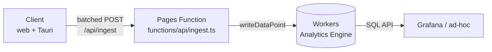
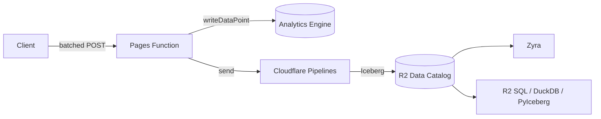

# Analytics Implementation Plan

Telemetry for Interactive Sphere — a structured event stream that answers
basic product questions (what layers are loaded, how long users dwell,
what Orbit interactions look like) and that Zyra can later ingest as a
first-class data source.

**Status: draft for review.** Tracking issue:
[#43](https://github.com/zyra-project/interactive-sphere/issues/43).
Scope is Phase 1 (Workers Analytics Engine + a minimal Pages Function)
with a sketch of Phase 2 (Pipelines → R2 / Iceberg → Zyra).

---

## Goals

- A small, well-defined event stream from the client (web + Tauri desktop)
- Queryable via SQL during development (Analytics Engine + Grafana)
- No third-party vendor, no data egress off Cloudflare
- Landed in a format Zyra can read directly in Phase 2 (R2 / Iceberg)
- Honest with users: a visible, truthful disclosure and a working toggle

## Non-goals

- Full product analytics (funnels, cohorts, session replay). If we need
  that later, revisit PostHog.
- User identity. Events carry an ephemeral session ID and nothing else.
- Real-time leadership dashboards. Phase 2+ concern.

---

## Constraints found during exploration

### 1. We have already promised users we don't do this

`src/ui/helpUI.ts:125` currently reads:

> Feedback submissions store the text you type plus your browser's user
> agent and the current page URL. Attaching a screenshot is optional and
> opt-in. **We do not collect analytics or tracking cookies.**

That sentence has to change the instant any telemetry ships. The plan
keeps faith with the spirit of the promise (anonymous, minimal,
user-controllable) and rewrites the copy to match reality.

### 2. Infrastructure already exists — don't build a second stack

The app is a Cloudflare Pages project with Pages Functions under
`functions/api/*`, a D1 database (`FEEDBACK_DB`) for ratings + general
feedback, and a Workers AI binding. `wrangler.toml` is a Pages config,
not a standalone-Worker config.

The issue proposes a separate Worker at `analytics.interactive-sphere.*`.
That works, but it adds a deploy target, a domain decision, and a second
CI path. **Phase 1 recommendation: land the ingest endpoint as a Pages
Function** (`functions/api/ingest.ts`) alongside the existing feedback
endpoints, with an Analytics Engine binding added to `wrangler.toml`.
Same origin as the app (no CORS, no subdomain politics), same deploy
pipeline, same local-dev story. Separate Worker remains available as a
Phase 1.5 escape hatch if we hit a scaling or isolation reason.

### 3. Feedback already has a home — don't double-write content

General feedback (`/api/general-feedback` → D1) and per-message AI
ratings (`/api/feedback` → D1) already capture the *content* of user
feedback with explicit consent (the submit button is the consent). The
`feedback` telemetry event is not a replacement — it is a lightweight
envelope (`kind`, `context`, `status`) emitted *alongside* the existing
D1 write so the funnel shows up in the event stream. The prose lives in
D1 where it already lives.

### 4. Web + desktop, one emitter

The Tauri desktop app shares 100 % of the TS. Analytics must work in
both. The ingest URL is relative (`/api/ingest`), which resolves to the
Pages origin on web and to the same origin via the existing Pages proxy
on desktop. Desktop uses the same lazy-loaded `@tauri-apps/plugin-http`
fallback pattern used by `llmProvider.ts` and `downloadService.ts` to
bypass webview CORS when it matters.

---

## Two-tier consent model

One flat "telemetry on / off" toggle forces a bad trade: either we
collect enough to answer product questions (but betray the existing
privacy copy) or we stay honest (and learn nothing). Two tiers
resolves that tension.

| Tier | Name | Default | Contents | User-visible |
|---|---|---|---|---|
| **A** | Essential | **ON**, disclosed | `session_start`, `layer_loaded`, `feedback` envelope | Mentioned in the Privacy section of the Help panel; toggle in Tools → Privacy |
| **B** | Research | **OFF**, opt-in | `dwell`, `orbit_interaction` | Checkbox in Tools → Privacy, opt-in copy explaining the research use case |
| **Off** | — | — | Emitter becomes a no-op; no network calls | A single "Disable all telemetry" control |

Tier A is the kind of aggregate usage signal every shipping app needs
to know whether a build is broken. It carries no free text, no
per-view timings, no prompt content. Tier B is the interactive /
behavioural layer — what users ask Orbit, how long they sit on a
layer. It's useful for research (and for Zyra training data downstream)
but crosses a privacy bar that warrants affirmative consent.

**Compile-time kill switch.** Both tiers honour a build flag:
`VITE_TELEMETRY_ENABLED=false` at build time dead-code-eliminates the
emitter entirely. Satisfies the issue's "verified by network
inspection" acceptance criterion for builds that ship without
telemetry (e.g., a federal-delivery build where infosec says no).

### Rewritten privacy copy

`src/ui/helpUI.ts` Privacy section becomes:

> **Feedback.** Submissions store the text you type plus your
> browser's user agent and the current page URL. Attaching a
> screenshot is optional and opt-in.
>
> **Anonymous usage data.** Interactive Sphere reports a small set of
> anonymous events — app starts, which data layers are loaded, and
> whether feedback was submitted — so we can tell which builds are
> healthy and which layers people reach for. Events carry a
> per-session random ID that is regenerated every launch and never
> linked to you. No cookies, no third-party vendors, no PII. You can
> disable this, or opt in to richer research telemetry, from **Tools
> → Privacy**.

---

## Phase 1 architecture



Same origin. One new Pages Function. One new binding in `wrangler.toml`.

### Event schema

The catalog is intentionally staged. **Core v1** (the five events in
issue #43) ships first and proves the pipeline. **Expanded catalog**
(below) is the full design surface — land it incrementally, as each
event earns a question someone actually asked. Everything lives in
`src/types/index.ts` as a discriminated union so the Pages Function and
the client validate against the same shape.

#### Core v1 — Tier A unless noted

| Event | Tier | `blobs[]` (strings) | `doubles[]` (numbers) | `indexes[]` |
|---|---|---|---|---|
| `session_start` | A | `event_type`, `app_version`, `platform` (`web`/`desktop`), `locale`, `viewport_class` (`xs`/`sm`/`md`/`lg`/`xl`), `vr_capable` (`none`/`vr`/`ar`/`both`) | — | `session_id` |
| `session_end` | A | `event_type`, `exit_reason` (`pagehide`/`visibilitychange`/`clean`) | `duration_ms`, `event_count` | `session_id` |
| `layer_loaded` | A | `event_type`, `layer_id`, `layer_source` (`network`/`cache`/`hls`/`image`), `slot_index`, `trigger` (`browse`/`orbit`/`tour`/`url`/`default`) | `load_ms` | `session_id` |
| `layer_unloaded` | A | `event_type`, `layer_id`, `slot_index`, `reason` (`replaced`/`home`/`tour`/`manual`) | `dwell_ms` | `session_id` |
| `feedback` | A | `event_type`, `context` (`general`/`ai_response`), `kind`, `status` | `rating` (−1 / 0 / +1) | `session_id` |
| `dwell` | B | `event_type`, `view_target` (`chat`/`info_panel`/`browse`/`tools`/`dataset:<id>`) | `duration_ms` | `session_id` |
| `orbit_interaction` | B | `event_type`, `interaction` (`message_sent`/`response_complete`/`action_executed`/`settings_changed`), `subtype`, `model` | `duration_ms`, `input_tokens`, `output_tokens` (nullable) | `session_id` |

`session_end` + `layer_unloaded` are Tier A cheap wins — they pair with
the existing start/load events to give durations without any extra
opt-in cost. Adding `trigger` to `layer_loaded` is the single most
valuable dimension we can capture: it lets us answer *"did Orbit
actually drive loads?"* without joining across events.

#### Expanded catalog — for heatmaps, tours, AI training

##### Spatial attention

Heatmaps of "where did people look on Earth" + "what did they click."

| Event | Tier | `blobs[]` | `doubles[]` | Notes |
|---|---|---|---|---|
| `camera_settled` | A | `event_type`, `slot_index`, `projection` (`globe`/`mercator`) | `center_lat`, `center_lon`, `zoom`, `bearing`, `pitch` | Fire on MapLibre `moveend`. One event per settle; no mid-flight sampling. Globe-only → the `slot_index` + camera tuple is the heatmap input |
| `map_click` | A | `event_type`, `slot_index`, `hit_kind` (`surface`/`marker`/`feature`/`region`), `hit_id` (marker id, nullable) | `lat`, `lon`, `zoom` | Captures attention foci. `lat`/`lon` are rounded to 3 decimals (~110 m) by the client to cap cardinality |
| `viewport_focus` | A | `event_type`, `slot_index`, `layout` (`1globe`/`2globes`/`4globes`) | — | When the user promotes a panel in multi-globe layout. Cheap focus signal |

Design: coordinates live in `doubles[]`. That's exactly what AE +
Iceberg will bucket efficiently for hex / H3 tile aggregation
downstream. *Never* emit a per-frame camera sample — one event per
`moveend` bounds volume to user intent, not frame rate.

##### Tours

Tour playback is a controlled narrative — the events tell us which
stories land and which get abandoned.

| Event | Tier | `blobs[]` | `doubles[]` |
|---|---|---|---|
| `tour_started` | A | `event_type`, `tour_id`, `tour_title`, `source` (`browse`/`orbit`/`deeplink`) | `task_count` |
| `tour_task_fired` | A | `event_type`, `tour_id`, `task_type` (`flyTo`/`loadDataset`/`showRect`/`pauseForInput`/…) | `task_index`, `task_dwell_ms` |
| `tour_paused` | A | `event_type`, `tour_id`, `reason` (`user`/`pauseForInput`/`error`) | `task_index` |
| `tour_resumed` | A | `event_type`, `tour_id` | `task_index`, `pause_ms` |
| `tour_ended` | A | `event_type`, `tour_id`, `outcome` (`completed`/`abandoned`/`error`) | `task_index`, `duration_ms` |

`task_type` is a closed enum matching the `TourTaskDef` kinds in
`src/types/index.ts`. `task_dwell_ms` on `tour_task_fired` is the time
spent on the *previous* task — letting us build a drop-off curve per
task type (which is where the real insight is: *"half our users bail at
the third `pauseForInput`"*).

##### Tools, playback, UI state

| Event | Tier | `blobs[]` | `doubles[]` |
|---|---|---|---|
| `layout_changed` | A | `event_type`, `layout` (`1globe`/`2globes`/`4globes`), `trigger` (`tools`/`tour`/`orbit`) | — |
| `playback_action` | A | `event_type`, `layer_id`, `action` (`play`/`pause`/`seek`/`rate`) | `playback_time_s`, `playback_rate` |
| `settings_changed` | A | `event_type`, `key` (`telemetry_tier`/`reading_level`/`vision_enabled`/`labels`/`borders`/`terrain`/`auto_rotate`/`legend`/`info_panel`), `value_class` (bucketed, never free text) | — |
| `browse_opened` | A | `event_type`, `source` (`tools`/`orbit`/`shortcut`) | — |
| `browse_filter` | A | `event_type`, `category` (closed enum), `result_count_bucket` (`0`/`1-10`/`11-50`/`50+`) | — |
| `browse_search` | **B** | `event_type`, `query_hash` (SHA-256 of lowercased query), `result_count_bucket` | `query_length` |

`browse_search` carries a hashed query, not the text. That's enough to
collapse repeats (*"users type these same 200 queries over and over"*)
without storing free text. The full text never leaves the client.

##### VR / AR

| Event | Tier | `blobs[]` | `doubles[]` |
|---|---|---|---|
| `vr_session_started` | A | `event_type`, `mode` (`ar`/`vr`), `device_class` (`quest`/`quest-pro`/`vision-pro`/`pcvr`/`unknown`) | `entry_load_ms` |
| `vr_session_ended` | A | `event_type`, `mode`, `exit_reason` (`user`/`error`/`session_lost`) | `duration_ms`, `median_fps` (nullable) |
| `vr_placement` | A | `event_type`, `layer_id` (nullable), `persisted` (`true`/`false`) | — |
| `vr_interaction` | B | `event_type`, `gesture` (`drag`/`pinch`/`thumbstick_zoom`/`flick_spin`/`hud_tap`) | `magnitude` (rotation deg or zoom factor) |

##### Performance & errors

| Event | Tier | `blobs[]` | `doubles[]` |
|---|---|---|---|
| `perf_sample` | A | `event_type`, `surface` (`map`/`vr`), `webgl_renderer_hash` (SHA-256 of `WEBGL_debug_renderer_info`, first 8 hex) | `fps_median_10s`, `frame_time_p95_ms`, `jsheap_mb` (nullable) |
| `error` | A | `event_type`, `category` (`tile`/`hls`/`llm`/`download`/`vr`/`tour`/`uncaught`/`console`/`native_panic`), `source` (`caught`/`window_error`/`unhandledrejection`/`console_error`/`console_warn`/`tauri_panic`), `code` (HTTP status or classified enum), `message_class` (sanitized first line, ≤ 80 chars) | `count_in_batch` (for deduped repeats) |
| `error_detail` | **B** | `event_type`, `category`, `source`, `message_class`, `stack_signature` (SHA-256 of normalized stack, first 12 hex), `frames_json` (compact array of `{fn, line}` pairs, function names only, max 10 frames) | `count_in_batch` |

Two-tier error model — the same pipeline, two different emission paths:

- **Tier A `error`** is classified and message-normalized but carries
  no stack. Enough signal to say *"v0.8.2 has a 40× spike in
  `category=hls`"* and to group by `message_class`, not enough to
  debug a specific crash. Safe for default-on.
- **Tier B `error_detail`** carries a sanitized stack frame list plus
  a stack signature so we can cluster without re-shipping the stack
  on every occurrence. Function names only, **never URLs / file paths
  / line-column pairs outside our own bundle**.

### Console and crash capture

Three capture mechanisms feed the error pipeline. All three funnel
through the same sanitizer + deduplicator before reaching the
emitter, so the tier gate applies once at the end.

| Mechanism | Catches | `source` | Where it lives |
|---|---|---|---|
| `window.addEventListener('error')` | Uncaught sync errors from script | `window_error` | `src/analytics/errorCapture.ts` |
| `window.addEventListener('unhandledrejection')` | Unhandled promise rejections | `unhandledrejection` | same |
| `console.error` / `console.warn` monkey-patch | Library-internal errors that log but don't throw (MapLibre, HLS.js, Three.js, Tauri plugins) | `console_error` / `console_warn` | same |
| Explicit call sites — `reportError(category, err)` | Caught errors that the code wants to report | `caught` | Throughout services — the classification pattern we already planned |
| Rust `std::panic::set_hook` → `emit_to('native_panic')` | Tauri main-process and webview panics | `tauri_panic` | `src-tauri/src/main.rs` |

#### Sanitization (runs before emission, for both tiers)

Applied in `src/analytics/errorCapture.ts` to every captured error:

1. **URL stripping.** Replace any `https?://[^\s]+` in messages or
   stack frames with the literal `<url>`. Catches tile URLs with auth
   tokens, API endpoints, Vimeo CDN URLs
2. **Email and UUID stripping.** Regex-replace with `<email>` / `<uuid>`
3. **Long digit runs → `<num>`.** Catches auth codes, timestamps,
   session tokens that leaked into messages
4. **File-path normalization.** Strip everything up to `/src/` or
   `/node_modules/` so only the app-relative path remains. Drop
   anything ending in `.tauri` or `asset.localhost` (local file
   server paths)
5. **Function-name allowlist.** Stack frames outside our own namespace
   (everything not from `src/`, `@maplibre/*`, `three`, `hls.js`,
   `@tauri-apps/*`) collapse to a single `<external>` marker.
   Prevents browser-extension and ad-blocker noise from leaking into
   the stream
6. **Message-class derivation.** Take the first line of the error
   message, apply strips above, truncate to 80 chars. That's
   `message_class` — the field used for grouping
7. **Cross-origin "Script error." drop.** Chrome returns the literal
   string `"Script error."` for cross-origin script errors. These
   carry no information; drop them at the source

#### Deduplication and rate limits

A single bad build can emit a million errors from one bad render
loop. Mandatory dedup:

- **In-memory signature cache** per session: key =
  `category|source|message_class|stack_signature`
- On repeat: increment a counter, do **not** re-emit
- Flush cadence: emit the aggregated counter (as `count_in_batch` on
  the next fresh event of that signature, or as a final
  `error_summary` on `session_end`)
- Hard caps per session:
  - Tier A `error`: ≤ 3 per unique signature, ≤ 30 total
  - Tier B `error_detail`: ≤ 1 per unique signature, ≤ 10 total
- Emitter's own internal errors are caught and silently dropped —
  never recurse

#### Reporter-internal error discipline

The error pipeline is in the privileged path. A bug in the reporter
must not:

- Loop (reporter's error → captured by reporter → re-emits → loop).
  Solved by a `reentrant` guard flag around the capture logic
- Break the app. Wrap all capture in a `try { … } catch { /* drop */ }`
  outer frame. A broken reporter is silently no-op, never a user-
  visible exception
- Leak to console. The monkey-patched `console.error` calls the
  original reference to print in dev builds; it does not recurse
  through the capture pipeline

#### What we still don't capture, even in Tier B

- **Raw error messages** beyond the 80-char sanitized `message_class`
- **Line / column numbers** inside frames — function name + source
  file only. Line numbers alone are low value and drift every build
- **`error.cause` chains** beyond one level deep — only the outermost
  cause's class
- **DOM element references** attached to errors (React-style
  component-trace data; we're vanilla TS but this matters if we ever
  adopt a framework)
- **`document.cookie`, localStorage, sessionStorage contents** — a
  common mistake is reporters that "helpfully" include client state.
  We do not
- **Orbit prompt text or response bodies** — if an Orbit call throws
  mid-stream, the error message carries the category only, never the
  partial response
- **Browser extension errors.** The function-name allowlist drops
  them, and we additionally drop any error whose outermost frame
  resolves to `chrome-extension://`, `moz-extension://`, or
  `safari-extension://`

#### The opt-in crash report flow — separate from general telemetry

For user-visible crashes — the ones where the globe goes blank or
the app freezes — the classified event stream is the wrong tool.
What you want in that moment is a rich, detailed report with user
context, but under affirmative consent for *that specific crash*.

Firefox and the Tauri ecosystem both solve this with a per-crash
consent prompt. Proposed flow:

1. A fatal error fires (top-level uncaught, WebGL context loss, HLS
   terminal error, or a user-surfaced *"something broke"* dialog)
2. A modal appears: **"Interactive Sphere ran into a problem. Send a
   crash report?"** with three buttons: *Send*, *Don't send*, *Send
   with details* (optional textarea, "what were you doing?")
3. On *Send*: collects the classified event (what Tier A already
   emits) plus the sanitized stack, plus the last 50 captured
   `console.error`/`warn` lines from this session, plus the current
   loaded-dataset IDs. Submits to `/api/crash-report` (a new Pages
   Function — separate endpoint, separate D1 table, separate
   retention policy). **Not** sent through the analytics stream
4. On *Don't send*: drop everything; no stream event
5. On *Send with details*: same as *Send* but includes the
   user-provided text and (optionally) a screenshot via the existing
   `screenshotService`

This model has three advantages:

- **Legal footing**: per-crash consent is unambiguous, works cleanly
  in GDPR / App Store posture
- **Signal quality**: users report the crashes that affect them, not
  every weird extension-induced console.error
- **Volume control**: naturally rate-limited by how many people hit
  crashes and hit *Send*

The crash-report endpoint is **not** part of Phase 1 ship scope for
this analytics work — it's a Phase 1.5 add-on, tracked as a separate
issue. But the pipeline is designed so that when we build it, the
same sanitizer + deduplicator feed it; we don't re-invent that logic.

#### Log buffer for feedback attachments

A related but distinct pattern: when a user submits feedback (the
existing Help → Feedback flow), offer an **"Attach recent log
messages"** checkbox. If checked, the submission includes the last
N captured errors/warnings from the in-memory sanitizer's ring
buffer (Tier-B storage, but Tier-setting-independent because the
user explicitly attached it).

This lives in the feedback D1 record, not the telemetry stream,
and reuses the existing `GeneralFeedbackPayload` shape with a new
optional `logBuffer?: ErrorLogLine[]` field.

#### Source maps

Minified stacks are unreadable. Options:

- **A.** Serve source maps alongside the production bundle. Simple.
  Exposes source code — but the code is already on GitHub so this is
  a paper-thin concern. Recommended default
- **B.** Server-side source-map resolution in the Pages Function.
  Maps live in R2, never reach the client. More work, zero user benefit
  for a public OSS project

Recommendation: **A**. The bundle is already inspectable via
`view-source`, and keeping useful stacks is worth more than
pretending the code is secret.

##### Orbit — richer capture (Tier B only)

The core `orbit_interaction` event is sufficient for *"is Orbit
getting used."* For AI training we need the conversation *shape*:

| Event | Tier | `blobs[]` | `doubles[]` |
|---|---|---|---|
| `orbit_turn` | B | `event_type`, `turn_role` (`user`/`assistant`), `reading_level`, `model`, `finish_reason` (`stop`/`length`/`tool_calls`/`error`) | `turn_index`, `duration_ms`, `input_tokens`, `output_tokens`, `content_length` |
| `orbit_tool_call` | B | `event_type`, `tool` (`load_dataset`/`fly_to`/`set_time`/…), `result` (`ok`/`rejected`/`error`) | `turn_index`, `position_in_turn` |
| `orbit_load_followed` | B | `event_type`, `dataset_id`, `path` (`marker`/`tool_call`/`button_click`) | `latency_ms` (from LLM suggestion → user click) |
| `orbit_correction` | B | `event_type`, `signal` (`thumbs_down`/`rephrased_same_turn`/`abandoned_turn`) | `turn_index` |

`content_length` (characters) stands in for the forbidden message body
— it carries enough signal for "are responses getting cut off?"
without the text.

`orbit_load_followed` is the single highest-value signal for Orbit's
usefulness: *did the user take the action Orbit suggested?* Derived
from pairing a `response_complete` / `action_executed` with a
subsequent `layer_loaded` where `trigger=orbit`.

`orbit_correction` captures implicit + explicit negative signal. The
two "implicit" forms — rephrased same turn, abandoned turn — are the
corpus you want most for fine-tuning: they're the pairs where the
model got it wrong.

#### What we deliberately don't capture

This list is part of the spec. A reviewer should be able to point at
the code and confirm none of these leave the client:

- **Prompt or response text** from Orbit. Only counts, token usage,
  classifier outputs
- **Search query text** in browse — hashed only
- **Feedback message bodies** (they live in D1 already with explicit
  submit-as-consent; the envelope event carries `kind` + `status`, not
  prose)
- **Stack traces, raw error messages, tile URLs, API keys, auth
  headers** — errors are classified to a closed enum at the emit site
- **Raw IP** — the Pages Function sees `CF-Connecting-IP` for rate
  limiting but does not pass it to `writeDataPoint()`
- **Mouse trails, keystroke events, scroll positions** — out of scope
  for product analytics; that's session replay
- **Persistent identifiers** — no cookies, no localStorage user IDs.
  The session ID is ephemeral per launch
- **Precise coordinates** — `map_click` rounds `lat`/`lon` to 3
  decimals; `camera_settled` bucketing by zoom level provides natural
  coarsening

#### Design notes

- `indexes[]` carries `session_id` only. Analytics Engine uses it for
  sampling/bucketing. One index slot per data point.
- Numeric measures always land in `doubles[]`; the ingest endpoint
  coerces and clamps (`load_ms` capped at 10 min, `duration_ms` at 4 h,
  `lat`/`lon` clamped to valid ranges) to keep cardinality and storage
  sane.
- `app_version` is read from a Vite `define` constant populated from
  `package.json`. Same source the feedback payload uses today.
- Per-event rate caps at the ingest endpoint: `camera_settled` ≤ 30/min
  per session, `dwell` ≤ 60/min, others ≤ 10/min. A runaway client
  gets throttled, not disconnected.
- **Schema versioning.** `session_start` carries a `schema_version`
  blob (not shown above to keep the table skim-friendly; add it
  alongside `app_version`). Bump on breaking changes; the Iceberg
  tables read old + new in parallel.
- **Environment tagging.** The Pages Function injects an
  `environment` blob (`production` / `preview` / `local`) into every
  event's `blobs[]` array at ingest time, based on the Cloudflare
  Pages environment serving the request. Clients never send this
  field; the server is the source of truth. Dashboards filter on
  `environment = 'production'` by default.

### Client — `src/analytics/`

Three new files:

| File | Responsibility |
|---|---|
| `src/analytics/emitter.ts` | Typed `emit(event)` API, batch buffer (20 events or 5 s), tier gate, offline queue, fetch client (web `fetch` + lazy Tauri `plugin-http`) |
| `src/analytics/config.ts` | Load/save `TelemetryConfig` from localStorage (`sos-telemetry-config`), compile-time flag check |
| `src/analytics/dwell.ts` | `trackDwell(target)` helper — start/stop timer, emit on stop; handles `visibilitychange` and page-hide |

`TelemetryConfig` lands in `src/types/index.ts`:

```ts
export type TelemetryTier = 'off' | 'essential' | 'research'

export interface TelemetryConfig {
  tier: TelemetryTier          // default: 'essential'
  sessionId: string            // regenerated per app launch, never persisted
}
```

Session ID: `crypto.randomUUID()` generated once on boot, held in
memory only. Never written to localStorage or the Tauri keychain.

Offline queue (Tauri only, web just drops): persist the pending batch
to `localStorage['sos-telemetry-queue']` on `beforeunload` /
`pagehide`. On next boot, flush before first new event. Cap the queue
at 200 events; overflow drops oldest-first.

### Wiring table

Grouped by event family. "Tier" is the minimum tier required — an
event in Tier B silently drops if the user is on Tier A.

| Event | Tier | File | Site |
|---|---|---|---|
| `session_start` | A | `src/main.ts` | After `await app.initialize()` in the `DOMContentLoaded` handler (~line 2049) |
| `session_end` | A | `src/analytics/emitter.ts` | On `pagehide` / `beforeunload`; flush synchronously via `navigator.sendBeacon` |
| `layer_loaded` | A | `src/services/datasetLoader.ts` | `loadImageDataset` on `Image.onload`; `loadVideoDataset` on HLS `canplay`. Measure `load_ms` from function entry. `trigger` passed in from the caller (browse / orbit / tour / url / default) |
| `layer_unloaded` | A | `src/services/datasetLoader.ts` + `src/main.ts` | Fire when a slot replaces its dataset or `goHome()` runs. Pair with the stored load timestamp for `dwell_ms` |
| `feedback` (general) | A | `src/ui/helpUI.ts` | Wrap the existing `submitGeneralFeedback()` call — emit with `status` from the response |
| `feedback` (ai_response) | A | `src/ui/chatUI.ts` | Inside `submitInlineRating()` alongside the `/api/feedback` POST |
| `camera_settled` | A | `src/services/mapRenderer.ts` | Hook MapLibre's `moveend` event. Throttle client-side to ≤ 30/min per session |
| `map_click` | A | `src/services/mapRenderer.ts` | Existing click handler; emit after the hit-test resolves `hit_kind` |
| `viewport_focus` | A | `src/services/viewportManager.ts` | On panel promotion in multi-globe layouts |
| `layout_changed` | A | `src/services/viewportManager.ts` | On `setEnvView()` or layout-picker invocation |
| `playback_action` | A | `src/ui/playbackController.ts` | Existing play/pause/seek handlers |
| `settings_changed` | A | `src/ui/toolsMenuUI.ts`, `src/ui/chatUI.ts` | Each settings mutation call site — key is hard-coded per site, value is bucketed |
| `browse_opened` | A | `src/ui/browseUI.ts` | On `open()` / show |
| `browse_filter` | A | `src/ui/browseUI.ts` | On category-chip toggle; `result_count_bucket` computed from current filtered list |
| `browse_search` | B | `src/ui/browseUI.ts` | On debounced search-input change; hash in `src/analytics/emitter.ts` before emit |
| `tour_started` | A | `src/services/tourEngine.ts` | `start()` |
| `tour_task_fired` | A | `src/services/tourEngine.ts` | Before `execute(task)` dispatch; include previous task's dwell |
| `tour_paused` / `tour_resumed` | A | `src/services/tourEngine.ts` | `pause()` / `resume()` entry points |
| `tour_ended` | A | `src/services/tourEngine.ts` | End of sequence, `stop()` call, or error bubble |
| `vr_session_started` | A | `src/services/vrSession.ts` | Right after `setSession()` resolves |
| `vr_session_ended` | A | `src/services/vrSession.ts` | On session `end` event |
| `vr_placement` | A | `src/services/vrPlacement.ts` | On Place-button tap (success + persist flag) |
| `vr_interaction` | B | `src/services/vrInteraction.ts` | Throttled bucket per gesture type |
| `perf_sample` | A | `src/analytics/emitter.ts` | 60-second rolling FPS sampler; emit one event per minute active |
| `error` | A | `src/analytics/errorCapture.ts` + call sites | Install global `error`, `unhandledrejection` handlers at boot. Monkey-patch `console.error` / `console.warn`. Classified call sites use `reportError(category, err)` |
| `error_detail` | B | `src/analytics/errorCapture.ts` | Same capture points as `error`, upgraded output when Tier B is active |
| `error` (`tauri_panic`) | A | `src-tauri/src/main.rs` | `std::panic::set_hook` → `app.emit_to('native_panic', payload)` → JS handler forwards to emitter |
| `dwell` (chat / info panel / tools / browse) | B | `src/ui/*.ts` | `trackDwell()` helper — start on open, stop on close/visibilitychange |
| `orbit_interaction` (message_sent) | B | `src/ui/chatUI.ts` | `handleSend()` after user text is appended to state |
| `orbit_interaction` (response_complete) | B | `src/services/docentService.ts` | On the `done` stream chunk — carry `duration_ms`, token counts |
| `orbit_interaction` (action_executed) | B | `src/ui/chatUI.ts` | Action-dispatch switch (load_dataset, fly_to, set_time, …) |
| `orbit_turn` | B | `src/services/docentService.ts` | User turn: before stream start. Assistant turn: on `done` chunk |
| `orbit_tool_call` | B | `src/services/docentService.ts` | Per tool chunk parsed from the stream |
| `orbit_load_followed` | B | `src/services/datasetLoader.ts` | In the `trigger === 'orbit'` branch of `layer_loaded`, pair with the last `response_complete` timestamp |
| `orbit_correction` | B | `src/ui/chatUI.ts` | Thumbs-down: `submitInlineRating()`. Rephrased / abandoned: detect in `handleSend()` via prev-turn metadata |

All Tier-B call sites short-circuit at the emitter boundary when
`tier !== 'research'`. A miswire cannot leak a Tier-B event to a
Tier-A user.

### Tools → Privacy UI

New section in the Tools popover (`src/ui/toolsMenuUI.ts`) and a small
panel (`src/ui/privacyUI.ts`) with:

- Radio group: Essential / Research / Off
- Read-only session ID display (helps users understand what's being
  sent and confirms it rotates per launch)
- Link to the Privacy section of the Help panel

Saves to `localStorage['sos-telemetry-config']`. Tier change takes
effect on next emit — no reload required.

### Server — `functions/api/ingest.ts`

```ts
interface Env {
  ANALYTICS: AnalyticsEngineDataset
}
```

Endpoint: `POST /api/ingest`. Body: a batch of events matching the
schema above. Pages Function responsibilities:

1. Content-type + size guard (reject > 64 KB bodies)
2. Zod validation against the five event shapes
3. Per-`session_id` rate limit — reuse the in-memory-per-isolate
   pattern from `general-feedback.ts` (5 req / 60 s / session)
4. `env.ANALYTICS.writeDataPoint({ blobs, doubles, indexes })` per
   event
5. Return `204 No Content` on success, `400` on schema error, `429`
   on rate-limit

`wrangler.toml` additions:

```toml
[[analytics_engine_datasets]]
binding = "ANALYTICS"
dataset = "interactive_sphere_events"
```

### Queries + dashboards

- Analytics Engine SQL API wired into Grafana as a datasource
- Two dashboards land with the implementation PR:
  - **Product health** (Tier A only): event volume, layer load times
    (heatmap by `layer_id`), crash / error rate, feedback feed, tour
    completion funnel
  - **Spatial attention** (Tier A `camera_settled` + `map_click`):
    H3-hex heatmap over `center_lat`/`center_lon`, zoom-level
    histogram, dataset-weighted attention (heatmap × `layer_id`)
- A third **Research** dashboard (Tier B) lives behind a feature flag
  and only shows data from opted-in sessions: Orbit tool-call Sankey,
  dwell-vs-interaction scatter, correction rate by model
- Query patterns documented in `docs/ANALYTICS_QUERIES.md` (lands with
  the first working ingest, not before)

---

## What we'll learn — research and AI-training use cases

The schema above is shaped by specific downstream questions. This
section exists so future contributors know *why* an event is defined
the way it is, and so privacy reviewers can see that each event earns
its cost.

### Product questions we want to answer

| Question | Primary events |
|---|---|
| Which datasets are actually used, vs. which just exist? | `layer_loaded` weighted by `layer_unloaded.dwell_ms` |
| What does Orbit drive users to? | `layer_loaded.trigger='orbit'`, `orbit_load_followed` |
| Where on Earth do users look while studying X dataset? | `camera_settled` × current `layer_id` (from a session-scoped join) |
| Which tours hold attention, which get abandoned? | `tour_started` / `tour_task_fired` / `tour_ended.outcome` |
| Which Orbit answers are wrong? | `orbit_correction` — thumbs-down + rephrase + abandon |
| How often does VR mode work end-to-end? | `vr_session_started` → `vr_session_ended.exit_reason` + `median_fps` |
| Is the app fast enough on real hardware? | `perf_sample.fps_median_10s` bucketed by `webgl_renderer_hash` |
| Which categories of dataset do users search for that we don't have? | `browse_search.query_hash` cross-referenced with `browse_filter.result_count_bucket='0'` |

### AI-training corpora this stream enables

The wildfire-simulation pipeline (and Zyra generally) needs training
data that pairs *human intent* with *observable action sequences on
real Earth-observation data*. Raw telemetry events are too granular to
train on directly; the value comes from derived tables built from
session-scoped joins.

Proposed derived datasets (built in the Zyra pipeline, not here):

| Derived table | Built from | What it trains |
|---|---|---|
| **Exploration sequences** | Session-ordered `layer_loaded` + `camera_settled` + `layer_unloaded` | Which layer combinations, in what order, do humans use to understand a phenomenon. Direct input for "suggest the next layer" recommender |
| **Question → action traces** | `orbit_turn` + `orbit_tool_call` + subsequent `layer_loaded(trigger=orbit)` + `orbit_load_followed` | Plan-act traces for an agent. User question, model reasoning (tool sequence), environment result, human acceptance signal |
| **Correction pairs** | `orbit_turn` (assistant) + `orbit_correction` + next `orbit_turn` (user) | Negative examples for fine-tuning — the same turn-pair where the model got it wrong once, with the user's follow-up showing the correct framing |
| **Attention-weighted rasters** | `camera_settled` + `map_click` aggregated over H3 hex bins, weighted by session count | Geographic prior for "where does human attention concentrate on Earth." Input for spatial attention models and data-collection prioritization |
| **Tour completion labels** | `tour_started` → `tour_ended.outcome` | Which narrative structures hold attention. Useful signal for generated-tour quality evaluation |
| **Dataset affinity graphs** | Co-occurrence of `layer_id` within the same session | Dataset-to-dataset similarity learned from use, not metadata. Different signal from the SOS catalog's stated categories |

The important point: **the raw event stream has to carry enough
structure to reconstruct these derivations later.** That's why the
schema includes `turn_index`, `position_in_turn`, `task_index`,
`slot_index`, and a `trigger` field on load events — each one is a
foreign key that makes a derivation possible. Dropping any of them
would save a few bytes and cost a training table.

### What the stream can't do

Worth naming the limits so no one designs a model around data we
don't have:

- **Cross-session identity.** Session IDs rotate per launch. The same
  user studying a topic across three days is three separate sessions.
  This is a deliberate privacy property, not a bug. Aggregate patterns
  still work; per-user longitudinal study doesn't.
- **Prompt content.** We never see what users ask Orbit. Models
  trained on this stream see turn shape and tool sequences, not
  natural language. For prompt corpora we'd need an explicit,
  separately consented submission flow — out of scope here.
- **Ground truth for "good answer."** Thumbs-up / down is sparse and
  skewed. `orbit_correction` catches more cases but is noisy (a user
  rephrasing might be about their own clarity, not the model's). Any
  training signal from this corpus needs human-rater validation before
  it's trusted as a label.

---

## Phase 2 — R2 / Iceberg for Zyra

Client and Pages Function are unchanged. The Function fans out:



Changes:

- Pipelines binding added to `wrangler.toml`
- Iceberg schema mirrors the blobs/doubles/indexes layout, typed
  columns per event
- Zyra gains an R2 / Iceberg source adapter (tracked in the Zyra repo,
  not here)

Retention is solved automatically: Analytics Engine keeps 90 days
(hot), R2 / Iceberg keeps whatever we want (cold).

---

## Open questions

Carried over from #43, with my current leaning:

- **Separate Worker subdomain vs. Pages Function.** Recommendation
  above: Pages Function in Phase 1, revisit if we have a reason.
- **Domain / hosting.** Ingest lives at the app's own origin in the
  Pages Function path; the subdomain question goes away for Phase 1.
- **Retention.** Deferred to Phase 2 per the issue.
- **Consent / disclosure.** Addressed by the two-tier model + rewritten
  Help Privacy copy above. Juan Pablo should still review.
- **Schema ownership.** `src/types/index.ts` is the source of truth; the
  Pages Function imports the same types (same repo, same `tsconfig`),
  so drift is impossible by construction in Phase 1. Phase 2 factoring
  into a shared package is only needed once the Zyra adapter lands.

New questions this plan raises:

- **Do we want Tier A on by default for the desktop app specifically?**
  The Tauri build is the one with a keychain and local data; we could
  ship it with Tier A **off** by default and ask on first launch. Web
  defaults to Tier A on with disclosure.
- **Does the `feedback` envelope need the feedback `kind`?** That is
  already in D1. Including it in the event stream means we can build
  "which feature areas generate the most bug reports" without a
  cross-store join. I think yes, but it's borderline duplication.
- ~~**Do we want `error` as a sixth event type?**~~ Resolved — yes,
  with the two-tier model described in "Console and crash capture."

---

## Pre-implementation checklist

What else needs a decision or spec before code lands. Grouped by
priority — **Blockers** must be resolved in review; everything else
can be deferred to the implementation PR but should be captured here
so nothing slips.

### Resolved decisions — locked in during review

These were Blockers. All resolved:

- **First-launch UX — unified across web and desktop.** Tier defaults
  to `essential`. A persistent disclosure banner appears on first
  session and does not dismiss automatically: *"Interactive Sphere
  reports anonymous usage data. [Learn more](/privacy) · [Settings](#privacy)
  · [OK]"*. Banner is the same copy on web and desktop. No first-run
  modal on desktop — the install event is not held to a higher
  consent bar because the data collected is identical and a
  persistent banner is a stronger consent surface than a reflex-
  dismissed modal. Banner impression tracked as
  `settings_changed key=disclosure_seen` so we can tell whether users
  are seeing it. F-Droid and other "zero telemetry required" channels
  build with `VITE_TELEMETRY_ENABLED=false`, handled at compile time
- **Endpoint: Pages Function.** `functions/api/ingest.ts` alongside
  the existing feedback endpoints. No separate Worker, no subdomain
- **Runtime kill switch: Workers KV.** Pages Function reads a KV
  entry at edge on every request. Flipping the flag returns `410 Gone`
  to all clients; clients treat 410 as "stop sending for the rest of
  this session." Flipping is instantaneous across all edge caches
- **Source maps in production: yes.** The code is open-source on
  GitHub, so there's nothing to hide, and readable stacks are worth
  more than pretending otherwise
- **Dogfooding path: skipped.** No URL-param beta flag, no dev-only
  cohort. Preview-branch deploys still need to be distinguishable
  from production for health checks — handled by environment tagging
  (below), not by a separate dataset

### Environment tagging (replaces the dedicated-dev-dataset plan)

Single Analytics Engine dataset. The Pages Function reads its own
Cloudflare Pages environment at request time and injects an
`environment` dimension into every event before `writeDataPoint()`.
Client code doesn't participate — it can't lie about the environment
and doesn't need to know.

```ts
const environment =
  context.env.CF_PAGES_BRANCH === 'main' ? 'production'
  : context.env.CF_PAGES ? 'preview'
  : 'local'
```

- `production` — main branch
- `preview` — preview deploys (feature branches, PR previews)
- `local` — `wrangler pages dev` on a developer's machine

Queries filter by `environment = 'production'` to exclude preview
traffic from product dashboards. The Grafana dashboards default to
production; a variable switch flips them to preview for testing
changes.

Paired with the client-sent `app_version` blob (from `package.json`
via a Vite `define`), every event carries enough provenance to
isolate a specific build on a specific environment — without any
separate dataset or extra infrastructure.

### Remaining blockers — still need decisions

#### Privacy-policy entry-point audit

*Resolved in the latest revision of `docs/PRIVACY.md`.* The draft now
covers all entry points: telemetry, general feedback, Orbit ratings
(with the full conversation-submission description), Orbit chat
routing (our Cloudflare proxy → Workers AI by default, or a
user-configured provider), Vision Mode, crash reports, and what
stays on-device (chat history, API keys in keychain, offline
datasets, settings). Still needs external legal review — this review
is not something the engineering team signs off on.

#### Tier-change semantics mid-session

When the user toggles the tier from Tools → Privacy, what happens to
in-flight state?

- **Any tier → Off:** drop the in-memory batch queue immediately. No
  final flush. `session_id` is *not* rotated (rotating it would be a
  form of tracking). All subsequent emit calls no-op
- **Off → Essential:** start emitting fresh. Do *not* backfill any
  events that were suppressed during Off. Emit a synthetic
  `session_start` with a `resumed=true` flag so downstream analysis
  can tell this session began mid-app-lifetime
- **Essential → Research:** Tier A events keep flowing unchanged.
  Tier B call sites start firing at the next eligible boundary (e.g.
  the next `moveend`, the next `handleSend`). No backfill
- **Research → Essential:** stop Tier B emission immediately. Drop any
  Tier B events still in the batch buffer. Tier A events unaffected

These rules are non-obvious and need to be written into tests.

#### Schema evolution process

Events will evolve. We need a written workflow before the first
schema change happens, not after.

Proposed:

- `session_start` carries a `schema_version` blob (semver string, e.g.
  `"1.0"`)
- **Additive changes** (new event type, new blob field) bump the
  minor version. Old clients keep working; new dimensions show up as
  NULL in historical rows
- **Breaking changes** (rename, remove, type change) bump the major
  version. The Pages Function accepts both versions for a deprecation
  window (4 weeks), writes each to a version-tagged AE dataset slice
  or Iceberg table partition
- **Schema changes land in the same PR as the call-site changes.**
  Reviewer checklist includes: `TelemetryEvent` union updated,
  sanitizer rules verified, PRIVACY.md updated if user-visible, and
  the schema snapshot test regenerated

Document this in `docs/ANALYTICS.md` when it lands.

#### Security posture of `/api/ingest`

The endpoint accepts anonymous POSTs. Without discipline it's a free
event-forging surface and a DoS target.

Required controls:

- **Origin allowlist.** Pages Function checks `Origin` / `Referer`
  against a short list (`interactive-sphere.pages.dev`,
  `*.interactive-sphere.*` custom domains, `tauri://localhost` for
  desktop). Rejects with 403 otherwise. Not a strong forgery
  defense — anyone can spoof — but it stops casual drive-by forging
- **Per-IP + per-session rate limits.** Already in the plan; confirm
  both dimensions, not just session (a scripted forger cycles
  sessions)
- **Body-size cap.** 64 KB (already spec'd)
- **Schema validation.** Zod, fail-closed on unknown event types.
  Never let an unknown-shaped event reach `writeDataPoint()`
- **No auth token in the request.** Intentional — we want the endpoint
  usable from the Tauri webview without bundling a key. Trade-off
  explicit: a motivated forger can inject noise; nothing we put in the
  client can prevent that, and pretending otherwise is security theater
- **Circuit breaker.** If the endpoint's P95 latency or error rate
  crosses a threshold, the Pages Function returns `503 Retry-After: 300`
  and the client enters a 5-minute cooldown. Protects AE from cascade
  failures

I'd also recommend a simple **runtime kill switch**: an env var or KV
entry the Pages Function reads at edge, which if set causes it to
return `410 Gone` to all requests. Clients treat 410 as "stop sending
for the rest of this session" and do not retry. This is the "we
accidentally shipped a bug that's flooding AE" emergency brake.

#### Dev experience

Building this without a fast feedback loop is painful. Must-haves:

- **Console mode.** `VITE_TELEMETRY_CONSOLE=true` makes the emitter
  log every event to `console.debug` instead of sending. Default on
  in `npm run dev`, off in `npm run build`. Lets anyone add an emit
  call and see it fire without any backend wiring
- **Dev dataset.** A second AE dataset name (e.g.
  `interactive_sphere_events_dev`) bound in `wrangler.toml` under a
  separate env, selected when `CF_PAGES_BRANCH !== 'main'`. Preview
  deploys write to dev; main writes to prod. Standard Cloudflare
  pattern
- **Event inspector panel.** A hidden dev-only UI toggled by
  `?debug=telemetry` on the URL — shows the in-memory batch buffer,
  the dedup signature cache, and lets a dev force a flush. Lives
  behind the same dev flag as the existing `debugPrompt` in
  `DocentConfig`
- **Fixture-based tests for the sanitizer.** A table of nasty inputs
  (URLs with tokens, emails, UUIDs, stack traces containing prompts)
  and expected post-sanitization outputs. Snapshot-tested in CI

#### Testing strategy

- **Unit tests.** `emitter.ts` (batcher, tier gate, offline queue,
  session_id rotation, reentrant guard); `errorCapture.ts`
  (sanitizer table-driven tests, dedup behavior, capture discipline);
  `dwell.ts` (start/stop correctness, `visibilitychange` handling);
  `config.ts` (load/save, migration from unset)
- **Integration tests.** Using `@cloudflare/vitest-pool-workers` (or
  the miniflare-based equivalent), exercise the Pages Function with a
  fake AE binding. Confirm schema validation rejects bad shapes,
  rate limiter trips at the expected threshold, origin check rejects
  unknown origins
- **End-to-end smoke.** Playwright test that boots the app, exercises
  a handful of events, asserts the emitter saw them in console mode.
  Not a real ingest round-trip — that's flaky and AE has no dev
  tenant
- **Schema snapshot test.** Serializes the `TelemetryEvent` union
  shapes to a `.snap` file; a reviewer has to consciously regenerate
  on a schema change, which acts as the workflow trip-wire described
  above
- **Sanitizer fuzz test.** Seeded random inputs containing PII-like
  patterns; asserts no pattern leaks through

#### CI and lint enforcement

- **Lint rule: no direct `writeDataPoint()` outside
  `functions/api/ingest.ts`.** ESLint custom rule or a simple grep in
  CI
- **Lint rule: no direct `console.error` / `console.warn` in
  `src/analytics/errorCapture.ts`.** That file uses saved original
  references only
- **CI check: PRIVACY.md ↔ public/privacy.html parity** (when the
  page lands in the impl PR). Strip markdown formatting, compare
  normalized text, fail on drift
- **CI check: every new event in the `TelemetryEvent` union has a
  matching wiring-table row in this doc.** Annotation comment on the
  union type → doc-linter that enforces the row exists

### Medium priority — can be deferred to impl PR, but capture now

#### Observability of the telemetry pipeline itself

- **Synthetic heartbeat.** A cron trigger (Cloudflare Cron Trigger on
  a dedicated Worker) fires a test event every 15 min with a
  `synthetic=true` blob. Dashboard alarm fires if no heartbeat lands
  for 30 min. This is the "is the pipe open?" signal
- **Ingest error rate.** Alarm threshold: > 1 % 4xx or > 0.1 % 5xx
  over a 10-min window
- **AE quota tracking.** Panel in the Grafana dashboard showing
  current-month data-point count against the free-tier cap. Spike
  alerts at 70 / 90 %

#### Accessibility

- **Tools → Privacy panel.** Full keyboard access, radio group with
  proper `role` + `aria-*`, live-region status message on tier change
  ("Telemetry set to Essential"). WCAG AA contrast on all text
- **First-launch modal (desktop).** Focus-trapped, Esc defaults to
  *No telemetry* (not *Essential*) — the privacy-preserving default
- **`/privacy` page.** Skip-link to main content, semantic headings,
  WCAG AA contrast. No keyboard traps. Print stylesheet

#### Ownership and on-call

- **Schema ownership.** Who approves `TelemetryEvent` changes? Default:
  Interactive Sphere maintainers + one Zyra contact for Phase 2
  compatibility. Document in `docs/ANALYTICS.md`
- **Pipeline on-call.** Who gets the heartbeat alarm? Defer until
  we have a real user of the stream, which is post-Phase-2
- **Policy ownership.** Who reviews substantive `PRIVACY.md` changes
  (minor-version policy bump)? Recommend: project lead + infosec
  sign-off for anything that changes what's collected

#### Documentation deliverables

Listed elsewhere; consolidating:

- `docs/ANALYTICS.md` — user-facing schema + endpoint reference,
  includes the schema evolution process, the "how to add an event"
  checklist, and the dashboard inventory
- `docs/ANALYTICS_QUERIES.md` — SQL query patterns for the SQL API
  and example DuckDB / PyIceberg reads once Phase 2 lands
- `docs/PRIVACY.md` — canonical policy (this branch)
- `STYLE_GUIDE.md` additions — tokens / spacing for the Privacy panel
  and disclosure banner

### Low priority — explicit non-goals for Phase 1

Recording these so they don't sneak back in as scope creep:

- **Anomaly / bot detection.** Session-level outlier clustering can
  wait until we have traffic. Free-tier AE is cheap
- **Per-user longitudinal analysis.** Would require persistent IDs.
  Deliberately ruled out by the privacy posture
- **A/B experimentation framework.** Out of scope. Analytics observes;
  experiments actively assign. Different tool
- **Real-time dashboards for leadership.** Issue explicitly defers
  this to Phase 2+

---

## Acceptance criteria (from #43) → how this plan satisfies them

| Criterion | Addressed by |
|---|---|
| Running the Tauri app produces events visible in AE within 10 s | Batch flush interval = 5 s; AE ingest latency is sub-second |
| Grafana dashboard with the five panels, live data | Dashboards section above; lands with the first working ingest |
| Telemetry can be fully disabled via build flag, verified by network inspection | `VITE_TELEMETRY_ENABLED=false` → compile-time dead-code elimination; the runtime "Off" tier also zeros all network calls |
| `docs/ANALYTICS.md` documents schema, endpoint, queries | Split into this plan doc + a future `ANALYTICS.md` + `ANALYTICS_QUERIES.md` landed with the implementation PR |

---

## Privacy policy and the `/privacy` endpoint

Draft policy lives at [`docs/PRIVACY.md`](PRIVACY.md). It must be
reachable at a stable public URL before any telemetry ships — both
because it's best practice for a website and because it's a hard
requirement for several downstream distribution channels:

- **Apple App Store / Mac App Store.** App Store Review guideline 5.1.1
  requires a publicly accessible privacy policy URL in the App Store
  listing metadata
- **Google Play.** The Data safety section and Play policy require a
  privacy policy URL for any app that handles personal or sensitive
  data (we don't, but the platform definition is broad enough that
  "we collect anonymous analytics" trips the requirement)
- **Microsoft Store.** Requires a privacy policy URL for any app that
  accesses the network
- **F-Droid / Flathub / AUR.** Not strictly required by all three but
  reviewers expect it and flag its absence
- **Chrome Web Store.** If we ever package the web build as an
  installable PWA / Chrome app, it's required there too
- **NOAA / federal distribution.** If the app is referenced from a
  `noaa.gov` property, federal Privacy Act / E-Government Act posture
  applies and a linked policy is mandatory

A policy buried inside an in-app help panel does not satisfy any of
these channels. The URL has to be a direct link, reachable without
launching the app.

### Endpoint design

Single static page: **`public/privacy.html`**, served by Cloudflare
Pages at `/privacy.html` and at the clean `/privacy` URL.

- **Static, not SPA.** The page is self-contained HTML/CSS with no
  script dependencies. If the main app's JS bundle is broken, the
  privacy page still loads. This is a legal deliverable; it must not
  depend on the rest of the app working
- **Content is canonical in HTML.** The HTML is the ship artifact.
  `docs/PRIVACY.md` is the review-friendly mirror for GitHub and for
  diff-in-PR workflows. The implementation PR is responsible for
  keeping them in sync; a short CI lint (text equality after stripping
  markdown syntax) can enforce it
- **Visual consistency with the app.** Inline the design tokens from
  `src/styles/tokens.css` so the page uses the same dark palette
  (`--color-bg`, `--color-text`, `--color-accent`). No backdrop blur —
  this is a reading surface, not a glass overlay
- **Print-friendly.** `@media print` resets to black-on-white with
  serif body text. Legal teams print these
- **Accessible.** Semantic HTML5 (`<main>`, `<section>`, `<h2>`),
  WCAG-AA contrast, `lang="en"`, skip-link to main content, no
  images that carry meaning, logical heading order
- **No third-party fonts, no analytics on this page.** Fresh irony
  aside: the privacy page itself must be the one page that emits zero
  telemetry regardless of tier setting. The emitter gates on a URL
  check for `/privacy` and no-ops
- **Content-Security-Policy:** tight — `default-src 'self'; style-src
  'self' 'unsafe-inline'; script-src 'none'`. No script execution on
  the policy page

### Routing

`public/_redirects` currently ends with a SPA catch-all:

```
/docs/* /docs/:splat 200
/* /index.html 200
```

Add an explicit rule *before* the catch-all so `/privacy` never falls
into the SPA:

```
/privacy /privacy.html 200
/docs/* /docs/:splat 200
/* /index.html 200
```

Clean URL resolution on Pages should do this anyway, but belt and
braces — this is a legal URL and we want it to resolve deterministically
across every edge cache.

### Discoverability — where the link appears

The `/privacy` URL must be linked from, at minimum:

1. **Help panel → Privacy section** (`src/ui/helpUI.ts`) — replaces
   the current hardcoded paragraph with a summary + explicit "Read
   the full privacy policy" link
2. **Tools → Privacy panel** (`src/ui/privacyUI.ts`) — below the
   tier radio group
3. **First-launch modal on desktop** (if we go with Tier A off by
   default on Tauri — see open question) — a "Privacy" link sits
   next to the Accept / Skip buttons
4. **App store listings** — populated in the `tauri.conf.json`
   `publisher` / `homepage` / `privacyPolicy` fields so it flows into
   the generated install metadata
5. **Browse overlay footer** (new, small) — a slim `Privacy · Source ·
   NOAA SOS` link row at the bottom of the overlay. This is the "not
   buried" surface a casual visitor will notice without opening help
6. **`public/site.webmanifest`** — the PWA manifest gains an
   application `shortcuts` entry pointing to `/privacy`, so platforms
   that surface manifest shortcuts (Android PWA install, Edge sidebar)
   expose it as a first-class destination
7. **`package.json` `homepage` field** and the repository README —
   the policy link sits in the README's top metadata so GitHub,
   npm-ecosystem tools, and scrapers all find it

Items 1–3 are must-have before telemetry ships. Items 4–7 are
required before any mobile-store submission.

### Versioning

- The policy page carries a visible "Last updated: YYYY-MM-DD" line.
  The date updates only when the **substantive** content changes —
  typo fixes do not bump it
- Prior versions are preserved in git history; a linked "See previous
  versions" anchor at the bottom of the page points at the GitHub
  log for `docs/PRIVACY.md`
- Material changes get an in-app notice: a small banner on first
  launch after the update, dismissable, linking to the changed
  sections. Implementation lives alongside the existing Tauri-updater
  changelog dialog
- The `session_start` event's `schema_version` blob doubles as a
  proxy for "which policy version was in effect when this event was
  collected" — useful for retrospective compliance work

### What lands on this branch vs. the implementation PR

This branch is plan + policy draft. Specifically:

- ✅ `docs/ANALYTICS_IMPLEMENTATION_PLAN.md` — this doc
- ✅ `docs/PRIVACY.md` — policy draft, ready for legal review

The implementation PR (separate, follows plan approval) delivers:

- `public/privacy.html` — the live page
- `public/_redirects` — explicit `/privacy` rule
- `public/site.webmanifest` — shortcut entry
- In-app link wiring in `helpUI.ts`, `privacyUI.ts`, `browseUI.ts`
- Emitter URL-gate so the policy page emits zero events
- CI check enforcing `docs/PRIVACY.md` ↔ `public/privacy.html` parity

### Needs before release

- Legal review — especially sections 8 (children / classroom use) and
  9 (international users / GDPR-CCPA framing), which are intentionally
  loose in the draft
- Populate contact details in sections 1 and 11
- Confirm federal / NOAA-adjacent posture: if the app is distributed
  through a `noaa.gov` property the Privacy Act and E-Government Act
  may apply and the policy wording has to reflect that. Infosec
  conversation needed
- Confirm App Store metadata values — the `privacyPolicy` field in
  `tauri.conf.json` needs to point at a stable URL before any store
  submission

---

## Files touched

**New:**

- `src/analytics/emitter.ts`
- `src/analytics/config.ts`
- `src/analytics/dwell.ts`
- `src/analytics/errorCapture.ts` — global handlers, `console.*` patch, sanitizer, deduplicator, `reportError()` helper
- `src/ui/privacyUI.ts`
- `functions/api/ingest.ts`
- `public/privacy.html` — static policy page served at `/privacy`
- `docs/PRIVACY.md` — canonical source for the policy (this branch)
- `docs/ANALYTICS.md` — user-facing schema + endpoint reference
  (lands with the implementation PR)
- `docs/ANALYTICS_QUERIES.md` — SQL query patterns (lands with the
  Grafana dashboards)

**Modified:**

- `src/types/index.ts` — `TelemetryEvent` union, `TelemetryConfig`
- `src/main.ts` — emit `session_start`, wire dataset dwell, install `errorCapture` at boot before any other module runs
- `src-tauri/src/main.rs` — `std::panic::set_hook` forwarding to JS emitter (Tauri builds only)
- `src/services/datasetLoader.ts` — emit `layer_loaded`,
  `layer_unloaded`, `orbit_load_followed`, info-panel dwell
- `src/services/mapRenderer.ts` — emit `camera_settled`, `map_click`
- `src/services/viewportManager.ts` — emit `layout_changed`,
  `viewport_focus`
- `src/services/tourEngine.ts` — emit tour events
- `src/services/vrSession.ts` + `vrPlacement.ts` + `vrInteraction.ts`
  — emit VR events
- `src/services/docentService.ts` — emit `orbit_interaction`,
  `orbit_turn`, `orbit_tool_call`
- `src/ui/chatUI.ts` — emit message events, chat dwell,
  `orbit_correction`, AI-response `feedback`
- `src/ui/browseUI.ts` — emit `browse_opened`, `browse_filter`,
  `browse_search`
- `src/ui/playbackController.ts` — emit `playback_action`
- `src/ui/helpUI.ts` — emit general `feedback`, rewrite Privacy copy,
  link to `/privacy`
- `src/ui/toolsMenuUI.ts` — Privacy entry in the Tools popover
- `public/_redirects` — add an explicit `/privacy /privacy.html 200`
  rule before the SPA catch-all (belt-and-braces; clean URLs should
  handle it anyway)
- `wrangler.toml` — Analytics Engine binding
- `vite.config.ts` — `VITE_TELEMETRY_ENABLED` define + `__APP_VERSION__`
  constant if not already present
- `CLAUDE.md` — module-map rows for `src/analytics/*` +
  `src/ui/privacyUI.ts`

---

## Rollout order

1. **Plan review** (this PR). Approve the schema, the two-tier model,
   and the draft privacy policy before any code lands.
2. Types + emitter + config, no call sites wired, compile-flag default
   `true`. Unit tests for batch / offline queue / tier gating /
   `session_id` rotation.
3. Pages Function + Analytics Engine binding. Deploy behind a
   feature-flag header so only internal clients hit the production
   dataset until we're happy.
4. **Privacy policy page** (`public/privacy.html` + `/privacy` route)
   ships *before* the first real event. Policy first, telemetry
   second.
5. Tier A core call sites: `session_start`, `session_end`,
   `layer_loaded`, `layer_unloaded`, `feedback`. Update `helpUI.ts`
   Privacy copy and ship the Tools → Privacy UI in the same PR.
6. Tier A expansion: `camera_settled`, `map_click`, tour events,
   layout / playback / settings, `perf_sample`, `error`, VR events.
7. Product-health + spatial-attention dashboards + `ANALYTICS_QUERIES.md`.
8. Tier B call sites: `dwell`, `orbit_interaction`, `orbit_turn`,
   `orbit_tool_call`, `orbit_load_followed`, `orbit_correction`,
   `browse_search`, `vr_interaction`. Ship the opt-in copy alongside.
9. Research dashboard (Tier-B only, feature-flagged).
10. Phase 2: Pipelines + R2 / Iceberg. Separate issue, separate branch.
