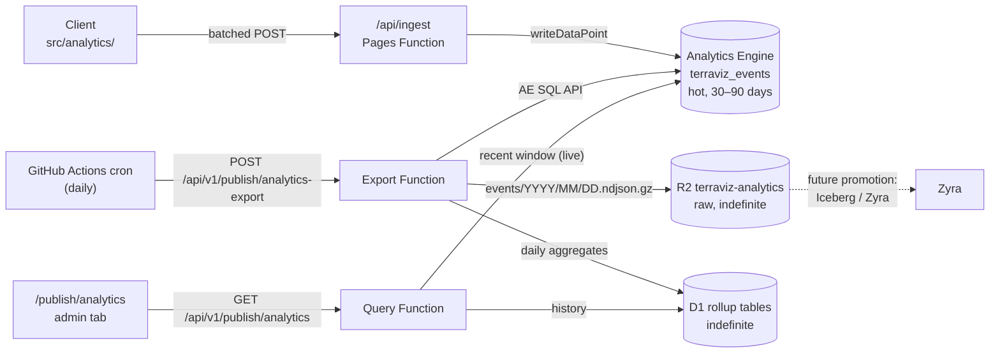

# Analytics Storage & Admin Dashboard Plan

Long-term storage for the Terraviz telemetry stream and an in-app
analysis surface inside the authenticated `/publish` portal — replacing
Grafana as the primary dashboard and outliving Analytics Engine's
30–90 day retention window.

**Status: implemented.** All four phases (A–D) have shipped; this
document now reads as the design record for the analytics storage
pipeline and the `/publish/analytics` + `/publish/feedback` admin
tabs. Per-phase "Status: landed" notes mark what each delivered.

> Companion docs:
> - [`ANALYTICS.md`](ANALYTICS.md) — the end-to-end pipeline reference
>   (collection side). This plan changes nothing about collection.
> - [`ANALYTICS_QUERIES.md`](ANALYTICS_QUERIES.md) — per-event
>   blob/double positional layouts + the SQL library this plan's
>   export job and dashboard panels are built from.
> - [`ANALYTICS_IMPLEMENTATION_PLAN.md`](ANALYTICS_IMPLEMENTATION_PLAN.md)
>   — the original design history. Its §"Phase 2 — R2 / Iceberg for
>   Zyra" sketched retention as a Pipelines → Iceberg fan-out; **this
>   plan supersedes that sequencing** (see §Decisions). Iceberg remains
>   the promotion path for the R2 archive, not the first step.
> - [`CATALOG_PUBLISHING_TOOLS.md`](CATALOG_PUBLISHING_TOOLS.md) — the
>   `/publish` portal architecture the new tabs slot into.
> - [`HERO_ADMIN_SCOPING.md`](HERO_ADMIN_SCOPING.md) — the
>   featured-hero feature whose privilege-gating pattern both new tabs
>   reuse.

---

## Problem statement

Collection is in good shape: a two-tier consent model, a documented
event catalog, and a single ingest point
(`functions/api/ingest.ts` → Workers Analytics Engine dataset
`terraviz_events`). Storage and analysis are not:

1. **Retention.** Analytics Engine keeps 30–90 days. There is no
   long-term record — every quarter we silently lose the ability to
   answer "how did this compare to last spring?".
2. **Grafana is the only analysis surface, and it's a poor fit.** It
   is an external dependency (separate deployment, separate auth, the
   Infinity datasource plugin), and it struggles to interpret AE's
   responses — the `$__from` milliseconds vs. AE `DateTime` mismatch,
   `_sample_interval` weighting, and the positional blob schema all
   have to be re-encoded by hand in every panel.
3. **Admin surfaces are fragmented.** Feedback review lives at
   `/api/feedback-admin` (a raw HTML/JSON endpoint behind Cloudflare
   Access or a bearer token), while the `/publish` portal already has
   real authentication (Access + the `publishers` D1 table with
   `is_admin` / `staff` roles), a router, a topbar, session handling,
   and a proven admin-gated page pattern (featured-hero). Operators
   bounce between three tools (portal, feedback endpoint, Grafana).

## Goals

- **Indefinite retention** of the telemetry stream, in a form that is
  both queryable by the app and promotable to Iceberg for Zyra later.
- **An in-app analytics dashboard** at `/publish/analytics` — no
  external dependency, privilege-gated, covering the panels we
  actually look at (including dataset-filtered spatial heatmaps).
- **One authenticated admin surface**: analytics and feedback review
  join the existing `/publish` portal.
- **No new external services.** Everything stays on Cloudflare
  primitives already in use (D1, R2, KV, Pages Functions) plus GitHub
  Actions, which already runs scheduled jobs for this repo.

## Non-goals

- **Cloudflare Pipelines / Iceberg now.** The R2 archive this plan
  lands is the *input* to that promotion; the Pipelines fan-out from
  `ANALYTICS_IMPLEMENTATION_PLAN.md` Phase 2 stays on the shelf until
  Zyra actually needs an Iceberg source adapter (see §Decisions).
- **Real-time dashboards.** The admin tab serves cached/aggregated
  views; AE's own few-second ingest lag already rules out true
  real-time, and nobody asked for it.
- **Per-publisher dataset analytics.** "Show publishers how their
  datasets perform" is `CATALOG_BACKEND_PLAN.md` Phase 4 territory.
  The `analytics_dataset_daily` rollup table in Phase A deliberately
  unblocks it, but the publisher-facing UI is out of scope here.
- **Removing Grafana.** It is demoted to an optional self-hosting
  extra (Phase D), not deleted. Ad-hoc SQL exploration through
  Grafana's editor still has value, and the spatial hex-bin panels
  are a useful cross-check while the in-app heatmap matures.
- **Changing collection.** No new client events, no schema changes to
  `src/analytics/**` or `functions/api/ingest.ts` (except the
  `publisher_portal_loaded` route enum gaining two values — §Phase B).

---

## Decisions

Three decisions were resolved with the project owner before drafting;
the alternatives are recorded so we don't relitigate them.

### D1. Long-term storage: nightly export → D1 rollups + R2 raw archive

| Option | Verdict | Why |
|---|---|---|
| **Nightly export job → D1 daily rollups + R2 raw NDJSON** | **Chosen** | Rollups are cheap to query from a Pages Function (the dashboard's data source); the raw archive preserves full fidelity indefinitely and can be promoted to Iceberg later without re-collecting anything. No new Cloudflare products. |
| Pipelines → R2 Data Catalog (Iceberg) at ingest | Deferred | The original Phase 2 sketch. Right shape for Zyra training data, wrong shape for a dashboard: Iceberg is effectively unqueryable from a Pages Function (needs DuckDB / R2 SQL tooling outside the app), and it adds a product dependency before anything consumes it. The R2 archive below is the same data; promotion is additive. |
| Dual-write raw events into D1 at ingest | Rejected | D1 caps at 10 GB per database and the event stream is unbounded; pruning raw rows to fit defeats the purpose. Also puts a second synchronous write on the hot ingest path. |

### D2. Admin surface: extend `/publish` with Analytics + Feedback tabs

| Option | Verdict | Why |
|---|---|---|
| **New `/publish/analytics` + `/publish/feedback` pages, privilege-gated** | **Chosen** | The portal already has Access auth, roles (`is_admin`, `staff`), a router, session-error handling, and the featured-hero precedent for admin-only pages. One sign-in, one UI. |
| Separate `/admin/*` lazy-loaded section | Rejected | Duplicates router/topbar/session plumbing for no isolation benefit; the role model already distinguishes operators from community publishers. |
| Leave feedback admin where it is | Rejected | Keeps two auth surfaces and a hand-rolled HTML dashboard that predates the portal. The `?action=` export endpoints survive (they're machine interfaces); only the HTML view is deprecated. |

### D3. Grafana: demoted to optional

The in-app tab becomes the primary analysis surface. `grafana/` stays
in the repo as a self-hosting extra for forks that want it, documented
as such (Phase D). Removal is a separate future decision once the tab
has covered the panels people actually use for a few months.

---

## Architecture



The ingest path is untouched. Everything new is read-side: a scheduled
export that drains AE into durable storage before the retention window
closes, and a query endpoint that stitches "live recent" (AE) onto
"historical" (D1) for the dashboard.

---

## Phase A — Export & retention pipeline

> **Status: landed** (same PR as this plan). Implementation:
> [`migrations/catalog/0019_analytics_rollups.sql`](../migrations/catalog/0019_analytics_rollups.sql)
> — the authoritative DDL (it adds an `environment` column to the
> spatial table beyond the sketch below; the dataset and spatial
> rollups exclude internal/staff traffic entirely, while
> `analytics_daily` keeps `internal` as a dimension) —
> `functions/api/v1/_lib/analytics-layouts.ts` (typed per-event
> layout registry + AE-row decoder, round-trip-tested against
> `ingest.ts`'s real encoder),
> `functions/api/v1/_lib/analytics-export.ts` (job core),
> `functions/api/v1/publish/analytics-export.ts` (route),
> `.github/workflows/analytics-export.yml` (daily 00:25 UTC tick).
> Remaining operator steps before the pipeline runs: create the
> `terraviz-analytics` R2 bucket and bind it as `ANALYTICS_R2`, set
> the `CF_ACCOUNT_ID` + `ANALYTICS_SQL_TOKEN` secrets on the Pages
> project, then drive the ≤90-day backfill with repeated
> `POST …/analytics-export?day=YYYY-MM-DD` calls (oldest first)
> while AE still remembers the rows. Full walkthrough:
> [`SELF_HOSTING.md`](SELF_HOSTING.md) Step 17.

### A1. Export endpoint

`functions/api/v1/publish/analytics-export.ts` — `POST`, exports one
UTC day per invocation (yesterday by default, or `?day=YYYY-MM-DD`
for backfill).

**Auth.** Living under `/api/v1/publish/**` puts it behind the
existing middleware (`functions/api/v1/publish/_middleware.ts`):
Cloudflare Access verifies the caller, and the JIT-provisioning table
already treats Access **service tokens** as `role = 'service'`,
`status = 'active'`. The endpoint additionally requires
`isPrivileged()` (admin / staff / service), the same check as
`featured-hero.ts`. This is exactly how `zyra-scheduler.yml` already
authenticates to the publish API — the GHA job reuses the
`CF_ACCESS_CLIENT_ID` / `CF_ACCESS_CLIENT_SECRET` secret pair, and no
new token-minting scheme is needed. Forks running without Access can
use `DEV_BYPASS_ACCESS` locally; a dedicated bearer-token fallback
(the `FEEDBACK_ADMIN_TOKEN` pattern) is noted as an open question
rather than built speculatively.

**Reading AE.** The function calls the AE SQL API
(`https://api.cloudflare.com/client/v4/accounts/{account}/analytics_engine/sql`)
with two new Pages secrets:

| Secret | Purpose |
|---|---|
| `CF_ACCOUNT_ID` | Account scope for the SQL API URL |
| `ANALYTICS_SQL_TOKEN` | API token, "Account Analytics Read" permission only |

Queries follow the conventions in
[`ANALYTICS_QUERIES.md`](ANALYTICS_QUERIES.md): counts are weighted by
`_sample_interval`, and the day boundary is
`timestamp >= toDateTime('<day>') AND timestamp < toDateTime('<day+1>')`.

### A2. R2 raw archive

A new bucket, `terraviz-analytics` (binding `ANALYTICS_R2`), separate
from `terraviz-assets` so asset lifecycle rules and access policies
never entangle with telemetry.

```
events/v1/2026/06/10.ndjson.gz
```

- One gzipped NDJSON object per UTC day. Each line is one AE row,
  decoded from positional blobs/doubles back into **named fields**
  using the layouts in `ANALYTICS_QUERIES.md`, plus the row's
  `_sample_interval`, `timestamp`, and the server-stamped envelope
  (`event_type`, `environment`, `country`, `internal`, `session_id`).
- Decoding at export time (rather than archiving raw positional rows)
  is deliberate: the positional layout is fragile by design —
  alphabetical field order shifts when a field is added — and the
  export job is the one place that pins layout knowledge. Archived
  lines stay self-describing forever.
- The `v1` path segment is the archive's own schema version; bump it
  if the line format ever changes incompatibly.
- NDJSON now, Iceberg later: when Zyra needs an Iceberg source, a
  one-off job converts the archive (or Pipelines takes over
  prospectively). Nothing about this layout blocks that.

**Privacy.** [`PRIVACY.md`](PRIVACY.md) §6 already discloses
"Cloudflare R2 object storage (long-term, Iceberg format) for research
analysis" — indefinite R2 retention is already promised to users. The
format wording should be loosened to not over-specify Iceberg (Phase
D doc pass; remember `npm run build:privacy-page`). The archive
contains nothing the AE stream doesn't: hashed queries stay hashed,
coordinates stay 3-decimal-rounded, session ids stay ephemeral.

### A3. D1 rollup tables

New migration in `migrations/catalog/` (next number after the current
head, `0018_workflows.sql`), applied to the same database that already
holds the catalog and feedback tables:

```sql
-- One row per (day, event_type, environment, internal, country, platform)
CREATE TABLE analytics_daily (
  day            TEXT NOT NULL,             -- 'YYYY-MM-DD' UTC
  event_type     TEXT NOT NULL,
  environment    TEXT NOT NULL,             -- production | preview | local
  internal       INTEGER NOT NULL,          -- 0 | 1
  country        TEXT NOT NULL,             -- ISO 3166-1 alpha-2 or 'XX'
  platform       TEXT NOT NULL DEFAULT '',  -- session_* only; '' elsewhere
  events_count   REAL NOT NULL,             -- sample-weighted
  sessions_count REAL NOT NULL,             -- distinct session ids seen (unweighted)
  metrics        TEXT NOT NULL DEFAULT '{}',-- JSON: named p50/p95s per type
  PRIMARY KEY (day, event_type, environment, internal, country, platform)
);

-- Dataset-level engagement; feeds the admin tab now and the
-- CATALOG_BACKEND_PLAN.md Phase 4 publisher analytics later.
CREATE TABLE analytics_dataset_daily (
  day          TEXT NOT NULL,
  layer_id     TEXT NOT NULL,
  environment  TEXT NOT NULL,
  loads        REAL NOT NULL,               -- layer_loaded, weighted
  trigger_mix  TEXT NOT NULL DEFAULT '{}',  -- JSON: browse/orbit/tour/url/default
  source_mix   TEXT NOT NULL DEFAULT '{}',  -- JSON: network/cache/hls/image
  load_ms_p50  REAL,
  load_ms_p95  REAL,
  dwell_ms_sum REAL,                        -- from layer_unloaded.dwell_ms (Tier A); NULL if none
  PRIMARY KEY (day, layer_id, environment)
);

-- Spatial bins for heatmaps that outlive AE retention.
CREATE TABLE analytics_spatial_daily (
  day         TEXT NOT NULL,
  event_type  TEXT NOT NULL,                -- camera_settled | map_click
  layer_id    TEXT NOT NULL DEFAULT '',     -- '' = default Earth / n.a.
  projection  TEXT NOT NULL DEFAULT '',     -- globe | mercator | vr | ar
  lat_bin     REAL NOT NULL,                -- floor(lat / 0.5) * 0.5
  lon_bin     REAL NOT NULL,
  hits        REAL NOT NULL,                -- sample-weighted
  PRIMARY KEY (day, event_type, layer_id, projection, lat_bin, lon_bin)
);

-- Export bookmark; makes the cron idempotent and backfill explicit.
CREATE TABLE analytics_export_state (
  id            INTEGER PRIMARY KEY CHECK (id = 1),
  last_day      TEXT NOT NULL,              -- newest fully-exported day
  updated_at    TEXT NOT NULL
);
```

Notes:

- **Sample-weighted counts are `REAL`, not `INTEGER`.** AE samples at
  write time; `count() * _sample_interval` is an estimate and storing
  it as a float keeps that honest.
- 0.5° bins (~55 km at the equator) match the resolution the Grafana
  spatial dashboards already round to, comfortably above the 3-decimal
  privacy floor applied at emit time, and keep the table small (a
  day's worth of bins is thousands of rows, not millions).
- **Camera attention is splatted over a zoom-derived footprint**, not
  point-binned: `camera_settled` describes a *view* of the globe, and
  its `zoom` field is an altitude proxy. The export distributes each
  event's weight over the bins inside a radius of `90° / 2^zoom`
  (floored at one bin, capped at 6°) with a linear-cone kernel,
  normalized so total attention mass is conserved — a zoomed-out
  view reads as a broad faint wash, a zoomed-in view as one
  concentrated cell. Map clicks stay point-binned (clicks are
  precise). See `splatFootprint()` in
  `functions/api/v1/_lib/analytics-export.ts`. Days exported before
  this landed hold point-binned rollups; an idempotent re-export
  (`?day=` or the backfill workflow) re-derives them while AE still
  has the raw rows.
- `metrics` / `trigger_mix` / `source_mix` are JSON columns rather
  than wide nullable column sets — D1 is SQLite, `json_extract()` is
  cheap, and the per-event metric vocabulary will drift.
- Country stays in the rollup at full (already-coarse) granularity;
  whether to collapse the long tail to a region enum is an open
  question (§Open questions).

### A4. Scheduler: GitHub Actions cron

A new workflow, `.github/workflows/analytics-export.yml`, daily
shortly after UTC midnight, modelled directly on
`zyra-scheduler.yml`:

- Same secret set (`TERRAVIZ_SERVER`, `CF_ACCESS_CLIENT_ID`,
  `CF_ACCESS_CLIENT_SECRET`); exits quietly when `TERRAVIZ_SERVER` is
  unset so forks don't collect red runs.
- Same keepalive step (GitHub disables scheduled workflows after 60
  days of repo inactivity; the existing pattern re-enables itself).
- Retries the POST a few times with backoff; the endpoint is
  idempotent (A5) so a duplicate tick is harmless.

**Why not a scheduled Worker?** Pages Functions can't carry cron
triggers, so a Worker would be a *second deployable* with its own
wrangler config, bindings, and deploy pipeline — for one HTTP call a
day. The repo already runs operational crons through GHA
(`zyra-scheduler.yml`) and the minutes-scale cron jitter is irrelevant
at daily cadence. If the project later grows a standalone Worker for
other reasons, the export trigger can move there; the endpoint doesn't
care who calls it.

### A5. Idempotency & backfill

- The endpoint reads `analytics_export_state.last_day` and exports
  `last_day + 1` through yesterday (normally a single day; multiple
  days after an outage). Explicit `?day=` re-exports one day.
- Per-day work is idempotent: D1 rollup rows are
  `INSERT OR REPLACE` on their primary keys, and the R2 object for a
  day is simply overwritten.
- On first deploy, a manual backfill loop walks back as far as AE
  still has data (≤ 90 days) — that is the entire recoverable
  history, which is exactly why this phase ships first.

### A6. Tradeoffs (honest)

| Tradeoff | Consequence | Mitigation |
|---|---|---|
| AE sampling | Rollups and the archive are estimates, not exact counts | Store sample weights; label dashboard panels "estimated"; sampling only kicks in at volumes Terraviz hasn't reached |
| Positional-layout coupling | The exporter must know every event's blob/double layout; a new event field shifts positions | The exporter pins to `ANALYTICS_QUERIES.md` layouts and `schema_version`; the existing contributing checklist already requires updating that doc with any event change — the exporter becomes one more consumer of the same contract |
| AE SQL dialect limits | No JOINs, limited functions; some rollups need multiple queries per day | Acceptable at one batch per day; the export job composes in TypeScript, not SQL |
| Export lag | The archive/rollups trail live data by up to a day | The dashboard's recent window reads AE live (Phase B); history is where lag doesn't matter |
| GHA cron reliability | Jitter (minutes) and the 60-day disable timer | Daily cadence absorbs jitter; keepalive step + idempotent catch-up absorb missed ticks |

---

## Phase B — `/publish/analytics` tab

> **Status: landed (v1).** Implementation:
> `functions/api/v1/_lib/analytics-query.ts` +
> `functions/api/v1/publish/analytics.ts` (typed section facade,
> KV-cached ~5 min), `src/ui/publisher/pages/analytics.ts` +
> `src/ui/publisher/analytics-charts.ts` (page + hand-rolled SVG
> charts), MapLibre heatmap lazy-imported on first spatial render.
> Deliberate v1 narrowings against the sketch below:
> - **Rollups only** — no live-AE recent window yet; data covers
>   complete UTC days through yesterday and the page says so. The
>   AE proxy leg can be added to the same endpoint without breaking
>   the page contract.
> - **No standalone perf section** — error counts live in Overview;
>   percentile *trends* need either a smarter rollup (per-day
>   environment-level percentiles without the country split) or the
>   live-AE leg. Folded into the open questions.
> - ~~**Funnel counts, not true funnels**~~ Resolved in the
>   tab-revisions follow-up: `analytics_outcomes_daily` (migration
>   0021) keeps `tour_ended.outcome` / `vr_session_started.mode`,
>   and the section shows completion rate + outcome mixes. The same
>   follow-up added the error-breakdown table
>   (`analytics_errors_daily`, 0020), idle-tab-aware view time
>   (`session_end.visible_ms` + metrics sums), error-rate tile, and
>   chart date-range labels.
> - Dataset ≈p50/≈p95 are loads-weighted averages of daily
>   percentiles, labelled as such in the UI.

### B1. Query endpoint

`functions/api/v1/publish/analytics.ts` — `GET`, behind the publish
middleware plus `isPrivileged()` (the featured-hero server-side
pattern). The portal never sees Cloudflare API tokens.

- **Recent window** (default 7 days, up to ~30): proxies the AE SQL
  API server-side using the same `CF_ACCOUNT_ID` /
  `ANALYTICS_SQL_TOKEN` secrets as the exporter — live data, no
  export lag.
- **History** (beyond the recent window): reads the D1 rollup tables.
- Responses cached in KV (the existing `CATALOG_KV` binding, keyed
  `analytics:v1:<query-shape>`, ~5 min TTL) so a dashboard refresh
  storm can't burn API quota.
- Query shapes are a fixed enum (overview, spatial, dataset, perf,
  funnel — one per panel group below), not pass-through SQL. The
  endpoint is a typed facade, not a SQL proxy.

### B2. Page & visualization catalog

`src/ui/publisher/pages/analytics.ts`, route `/publish/analytics` in
`src/ui/publisher/index.ts`, tab in
`src/ui/publisher/components/topbar.ts`. Client-side gate via the
`clientIsPrivileged()` check from `featured-hero.ts` (UI courtesy; the
API check is authoritative). Data via `publisherGet` from
`src/ui/publisher/api.ts`.

Global filters on every section: date range, environment
(production/preview), internal traffic on/off — the same defaults the
Grafana dashboards bake into their WHERE boilerplate.

| Section | Panels | Ported from |
|---|---|---|
| **Overview** | Sessions/day time series; platform / country / build-channel mix; returning-session share | `grafana/dashboards/product-health.json` |
| **Spatial attention** | MapLibre heatmap of `camera_settled` centers — filterable by **dataset** (`layer_id`), projection (globe / mercator / vr / ar), zoom band; `map_click` overlay split by `hit_kind`; zoom-distribution histogram | `grafana/dashboards/spatial-attention.json` (incl. the per-dataset query at `ANALYTICS_QUERIES.md` §camera_settled heatmap) |
| **Dataset engagement** | Top datasets by loads; trigger mix (browse / orbit / tour / url); load-source mix (network / cache / hls / image); on-globe dwell (Tier A `layer_unloaded.dwell_ms`); zero-result browse searches | `product-health.json` + `research.json` |
| **Performance & errors** | Error rate; p95 frame time by WebGL renderer hash; FPS distribution; `load_ms` p50/p95 | `product-health.json` |
| **Funnels** | Tour started→completed; VR session funnel (started → placed → ended, by device class); Orbit usage + neuron cost | `product-health.json` + `orbit-cost.json` |

**The spatial heatmap is a real MapLibre map.** MapLibre is already a
dependency and the catalog Map view
(`src/ui/catalogMapUI.ts` / `src/services/catalogMap.ts`) already
demonstrates the mount-a-secondary-map pattern. The panel feeds binned
points (recent window binned live from AE; history straight from
`analytics_spatial_daily`) into a GeoJSON source rendered with
MapLibre's native `heatmap` layer type, weighted by sample-corrected
hit counts. Dataset filtering works because every `camera_settled`
event carries the `layer_id` loaded at the moment the camera settled
(empty string = default Earth) — no schema change needed. VR/AR
sessions report gaze-ray coordinates, so the projection filter cleanly
separates "where do headset users look" from "where do 2D users pan".

**Charts.** Non-map charts (time series, bars, histograms) are
hand-rolled SVG — the catalog Timeline view
(`src/ui/catalogTimelineUI.ts`) already establishes the pattern and
the repo's no-framework stance. No charting library.

### B3. Implementation notes

- All strings through `t()` under `publisher.analytics.*`
  (`npm run check:i18n-strings` covers `src/ui/`).
- The `publisher_portal_loaded` route enum gains `analytics` (and
  `feedback`, Phase C) — a value addition, not a layout change, but
  it still gets a row update in `ANALYTICS.md` per the contributing
  checklist.
- New modules get their CLAUDE.md / `BACKEND_MODULES.md` rows in the
  same PR (`npm run check:doc-coverage` enforces this).
- Page styles join `src/styles/publisher.css` (the portal's lazy
  chunk); logical inline-axis properties per the RTL rules.

---

## Phase C — `/publish/feedback` tab

> **Status: landed.** Implementation:
> `functions/api/v1/publish/feedback.ts` (privilege-gated facade
> over the same `_feedback-helpers` data layer feedback-admin uses;
> AI + general dashboard views, on-demand screenshots),
> `src/ui/publisher/pages/feedback.ts` (tabbed review page with
> detail overlays), and the deprecation: a bare
> `GET /api/feedback-admin` now 302-redirects to
> `/publish/feedback`, with the `?action=` machine endpoints
> (exports, JSON dashboards, bearer-token fallback) surviving
> unchanged.

`src/ui/publisher/pages/feedback.ts` + route + tab, privilege-gated
like Phase B. Server side:
`functions/api/v1/publish/feedback.ts` (GET, middleware +
`isPrivileged()`), reading the existing D1 tables (`feedback`,
`general_feedback` — binding `FEEDBACK_DB`) directly. Feedback is
already stored indefinitely in D1, so this phase is pure UI
consolidation; no storage work.

- List views with kind filters (bug / feature / other; thumbs-up /
  thumbs-down), pagination, screenshot viewing (the
  `?action=screenshot` capability moves behind the typed endpoint),
  and the stored Orbit conversation context for AI ratings.
- Links out to the surviving machine exports
  (`/api/feedback-admin?action=ai-export|general-export`) rather than
  reimplementing CSV/JSONL streaming in the portal.
- **Deprecation:** the hand-rolled HTML dashboard served by
  `/api/feedback-admin` (no query params) is replaced by a redirect
  to `/publish/feedback`. The `?action=` JSON/CSV/JSONL endpoints
  stay — they are machine interfaces (scripts, spreadsheets) with the
  bearer-token fallback forks rely on.

---

## Phase D — Grafana demotion + documentation pass

> **Status: landed.** Grafana is now documented as optional/secondary
> in `grafana/README.md` and `SELF_HOSTING.md` Step 9; `ANALYTICS.md`'s
> "Where the data goes" diagram shows the export → R2/D1 → admin-tab
> legs with Grafana as an optional read side; `PRIVACY.md` §6 (and the
> generated `public/privacy.html`) drops the Iceberg-specific wording
> for format-neutral long-term R2 storage; `ANALYTICS_QUERIES.md` notes
> the export job as a third consumer of the positional layouts.

- `grafana/README.md` gains a prominent note: optional, for
  self-hosters; the `/publish/analytics` tab is the primary surface.
- [`ANALYTICS.md`](ANALYTICS.md) "Where the data goes" diagram gains
  the export → R2/D1 → admin tab legs; the Grafana references shift
  from "the read side" to "an optional read side".
- [`SELF_HOSTING.md`](SELF_HOSTING.md) — the export-pipeline
  walkthrough (R2 bucket + binding, SQL-API secrets, cron, backfill)
  already landed with Phase A as Step 17; what remains here is
  marking the Grafana walkthrough (Step 9) optional-and-demoted.
- [`PRIVACY.md`](PRIVACY.md) §6 wording loosened from "Iceberg
  format" to format-neutral long-term R2 storage
  (`npm run build:privacy-page` + the CI diff guard).
- `docs/ANALYTICS_QUERIES.md` gains a short "consumed by the export
  job" note so layout editors know the exporter is a third consumer
  (after Grafana and humans).

---

## Sequencing

| Phase | Delivers | Depends on |
|---|---|---|
| **A** — export pipeline | R2 archive + D1 rollups + daily cron; **stops the data loss** | nothing — ship first; every week of delay is a week of history AE will eventually drop |
| **B** — analytics tab | `/publish/analytics` with the five panel groups | A for history (can ship overview panels on live-AE-only earlier if useful) |
| **C** — feedback tab | `/publish/feedback`; feedback-admin HTML deprecated | nothing technically; sequenced after B to reuse its page patterns |
| **D** — docs + Grafana demotion | Updated docs, optional-Grafana posture | A–C landed |

Each phase is independently shippable and reviewable; A is the urgent
one because backfill can only reach as far back as AE still remembers.

## Open questions

- **Country granularity in rollups.** Full ISO country list keeps
  rollup rows honest but multiplies cardinality; collapsing the long
  tail (e.g. keep top ~20, bucket the rest by continent) would shrink
  `analytics_daily` considerably. Leaning: keep full granularity —
  the table is small at daily grain — but revisit if D1 growth says
  otherwise.
- **Raw-archive pruning policy.** "Indefinite" is the default and is
  already disclosed in PRIVACY.md, but a deliberate policy (e.g.
  drop Tier B event lines after N years) may be worth adopting
  proactively. Needs a privacy-posture discussion, not a technical
  one.
- **Bearer-token fallback for the export endpoint.** Forks without
  Cloudflare Access can't mint service tokens. Add a
  `ANALYTICS_EXPORT_TOKEN` fallback (the `FEEDBACK_ADMIN_TOKEN`
  pattern) only if a self-hoster actually asks.
- **Publisher-visible analytics slice.** `analytics_dataset_daily` is
  shaped so a future non-admin page can show publishers their own
  datasets' numbers (`CATALOG_BACKEND_PLAN.md` Phase 4). Whether that
  surface filters by the publisher's own datasets only, and what it
  exposes, is deferred to that plan.
- **Orbit cost panels and Workers AI quotas.** The `orbit-cost.json`
  panels exist to warn about free-tier neuron exhaustion; whether the
  admin tab should add an explicit threshold warning (vs. just the
  chart) is open.
