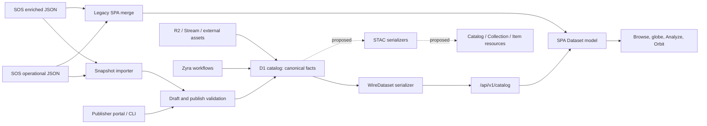

# Terraviz Metadata and STAC Alignment

**Status:** Analysis and implementation proposal
**Audit date:** 2026-09-03
**Last reviewed:** 2026-09-06
**Standards target:** STAC core 1.1.0; STAC API 1.0.0 only in a later API phase

**Design added:** 2026-09-08 (node-specific metadata, publication boundaries,
extension ownership, and vocabulary interoperability for
[issue #428](https://github.com/zyra-project/terraviz/issues/428); not a new
review of the full census or standards registry).

**Revisit when:** Phase 4 federation ships; a deployed D1 catalog materially
diverges from the checked-in SOS snapshot; a stable STAC core release supersedes
1.1.0; or the native-wire versus separate-projection decision changes.

## Purpose

This document describes how dataset metadata enters, changes, and leaves
Terraviz, then proposes a path for publishing that metadata as valid
[SpatioTemporal Asset Catalog (STAC)](https://stacspec.org/) resources.

The central recommendation is:

> Add a separate STAC 1.1.0 projection over the canonical D1 catalog. Do not
> replace the existing `WireDataset` contract or convert the SPA's runtime
> `Dataset` objects into STAC.

This preserves current clients while providing a standards-oriented surface
whose provenance, spatial coverage, temporal coverage, licensing, and assets
can be stricter than the presentation model.

## Relationship to earlier decisions

This recommendation intentionally changes the STAC direction recorded in two
earlier planning documents:

- [`../architecture/federation-scoping.md`](../architecture/federation-scoping.md)
  Section 7, Directive 3 and Section 8, decision 5 require the native wire
  `Dataset` to become a STAC Item profile in the same change as the federation
  feed.
- [`../CATALOG_BACKEND_PLAN.md`](../CATALOG_BACKEND_PLAN.md) under "STAC
  alignment" makes the same wire-profile decision, pins STAC 1.0.0, treats
  `/api/v1/catalog` and signed feeds as STAC Collections, and explicitly
  declines Collection hierarchy as the primary resource model.

This document supersedes those choices of serializer boundary, resource
granularity, and STAC version. The revised decision is to keep `WireDataset`,
`/api/v1/catalog`, and signed federation feeds native, then publish a separate
D1-backed STAC Core 1.1.0 projection with explicit Collections and eligible
Items. It does not change the federation handshake, signing, transport,
schema-versioning, or conformance requirements.

The compatibility invariant behind the earlier decision still holds: a peer
must not receive required STAC fields only after it has begun consuming the
native federation feed. The separate projection satisfies that invariant by
construction because it never adds those fields to the feed. STAC resources
can therefore ship and evolve under their own routes and schemas without a
federation wire-format break.

## Executive summary

There are two active metadata worlds in the repository:

1. The default, D1-backed node catalog is the durable publishing system. It
   stores normalized dataset facts, decorations, media references, lifecycle
   state, licensing, checksums, and node provenance.
2. The legacy SOS path combines an operational JSON catalog with a richer
   descriptive JSON file by normalized title. It remains available as a
   fallback and is also the source for the bulk snapshot importer.

A third representation, the SPA `Dataset` type, is a runtime and display
model. It applies defaults, converts units, injects tours, and can synthesize
SOS-only records. It is useful to the viewer but is not an authoritative
metadata source.

The repository is structurally close to being able to emit STAC, but it is not
currently STAC compliant:

- `/api/v1/catalog` and `/api/v1/datasets/:id` return the proprietary
  `WireDataset` shape.
- The generated schemas under `public/schema/v1/` describe that proprietary
  contract.
- No STAC serializer, STAC resources, conformance declaration, or STAC API
  endpoints are implemented.
- Spatial and temporal metadata are too sparse to publish every current record
  as an honest STAC Item.
- The current planning text assumes every dataset row should become an Item.
  That loses the distinction between a durable product or series and an atomic
  observation, revision, or frame.

The safe migration is additive: retain the native catalog, create explicit
Collection and Item granularity, remediate metadata where needed, and expose
only records that satisfy a documented STAC eligibility policy.

## Metadata architecture



### Source and contract inventory

| Surface | Location | Role | Authority |
|---|---|---|---|
| SOS operational catalog | `public/assets/sos-dataset-list.json` | Legacy media, display, temporal, probing, and globe fields | Upstream snapshot; not canonical after import |
| SOS enrichment catalog | `public/assets/sos_dataset_metadata.json` | Descriptions, categories, keywords, developers, related resources | Supplemental legacy source |
| Snapshot mapping | `cli/lib/snapshot-import.ts` | Normalizes both legacy files into publisher drafts | Import boundary |
| Publisher input | `DatasetDraftBody` in `functions/api/v1/_lib/validators.ts` | Create, edit, and publish contract | Write-side contract |
| Durable dataset row | `datasets` in `schema/catalog-schema.sql` | Canonical normalized facts and lifecycle | Primary system of record |
| Node organization profile | `node_profile` via `functions/api/v1/_lib/node-profile-store.ts` | Operator-authored organization name, mission, about text, regional focus, links, and logo | Stored profile is not automatically public; see the node-profile publication policy below |
| Decorations | `dataset_tags`, `dataset_categories`, `dataset_keywords`, `dataset_developers`, `dataset_related` | Repeatable classifications, people, and links | Canonical joins |
| Renditions | `dataset_renditions` | Codec, dimensions, bitrate, MIME type, reference, and digest per rendition | Canonical media variants |
| Native public wire type | `WireDataset` in `functions/api/v1/_lib/dataset-serializer.ts` | Backward-compatible public serialization | Public native contract, not full storage |
| Native catalog envelope | `CatalogResponseBody` in `functions/api/v1/catalog.ts` | Cached full or incremental dataset list | Public native protocol |
| SPA runtime type | `Dataset` in `src/types/index.ts` | Viewer-ready metadata | Derived presentation model |
| Protocol schemas | `public/schema/v1/*.schema.json` | Generated schemas for current native API | Machine-readable native contract |
| Asset manifest | `/api/v1/datasets/:id/manifest` | Resolves `data_ref` into image or video playback details | Delivery metadata |
| Frame API | `/api/v1/datasets/:id/frames` | Enumerates addressable image-sequence frames | Atomic asset metadata candidate |

### The canonical D1 model

The `datasets` table contains the core facts needed for a STAC projection:

- Identity and provenance: `id`, `slug`, `origin_node`, and `legacy_id`.
- Description: `title`, `abstract`, `organization`, and `website_link`.
- Temporal coverage: `start_time`, `end_time`, and ISO 8601 `period`.
- Spatial coverage: typed north, south, west, and east bounding columns.
- Asset references: primary data, thumbnails, sphere thumbnails, legend,
  caption, and color-table references.
- Media intrinsics: encoded and render dimensions, color space, bit depth,
  HDR transfer, alpha encoding, and primary codec.
- Integrity: delivered-content, source, auxiliary, and rendition digests.
- Scientific display semantics: probing metadata, `data-luma` render encoding,
  physical range, units, palette, transparency, and playback frame rate.
- Licensing and attribution: SPDX expression, URL, statement, attribution,
  rights holder, DOI, and citation.
- Publication state: visibility, hidden status, schema version, publish and
  retract timestamps, review timestamps, and publisher ownership.

Related tables add faceted categories, tags, keywords, developers, related
resources, and media renditions. The `node_identity` row supplies the local
node's identifier, display name, base URL, public key, and contact information.

Not every D1 table belongs in STAC. Tours, current events, blog posts,
publisher accounts, upload jobs, workflow runs, review state, and analytics
have their own operational meanings. They may link to a STAC resource, but
they should not be forced into Collection or Item fields merely because they
refer to a dataset.

### Native wire serialization is intentionally lossy

`serializeDataset()` joins the core row with decorations and resolves internal
asset references into URLs. It also:

- omits empty optional values;
- emits a bounding box only when all four persisted corners exist;
- parses probing JSON but drops malformed values;
- emits render encoding and color scale only as a valid pair;
- resolves tour JSON separately from image and video manifests;
- emits a frame envelope only when the sequence metadata is complete; and
- flattens categories, keywords, related resources, and developers under
  `enriched`.

The current TypeScript types expose different subsets of the stored metadata.
`DatasetRow` carries `content_digest`, `source_digest`, and both sphere
thumbnail references, but not `auxiliary_digests` or the media intrinsics
(`width`, `height`, render dimensions, color space, bit depth, HDR transfer,
alpha fields, and primary codec). `WireDataset` omits those intrinsics, the
sphere thumbnails, `content_digest`, and auxiliary digests; `source_digest`
appears only as the conditional image-sequence `framesDigest`. The backend has
no row type or reader for `dataset_renditions` at all. A STAC adapter built by
translating `WireDataset` would therefore discard useful metadata before
mapping starts, while rendition support requires a new read path rather than
simple plumbing.

The STAC read model should select the necessary D1 columns and joins directly,
or introduce a richer internal row type shared by the STAC serializers. It
should not depend on the native public response as an intermediate format.

### SPA transformations are not catalog facts

`src/services/dataService.ts` makes the native and legacy sources look uniform
to the rest of the application. During that process it can:

- normalize `image/jpg` and `images/jpg` to `image/jpeg`;
- replace a missing bounding box with the whole-world box on every runtime
  `Dataset`, so all downstream consumers lose the distinction between unknown
  and global coverage;
- parse and reject malformed data-encoding sidecars;
- restate physical units into more readable display units;
- inject bundled sample tours;
- merge enriched metadata by normalized title; and
- synthesize playable `SOS_ONLY_*` records from enrichment entries.

These transformations are valid presentation behavior. They must not become
STAC source data. In particular, "unknown spatial extent" and "global spatial
extent" are different claims.

## Checked-in legacy metadata audit

The following census describes the two committed SOS JSON files as of the
audit date. It does not claim to describe the contents of a deployed D1
database.

| Measurement | Result |
|---|---:|
| Operational snapshot rows | 204 |
| Unique operational IDs | 203 |
| Duplicated IDs | 1 ID appears twice (`INTERNAL_SOS_766_ONLINE`) |
| Enrichment rows | 520 |
| Operational rows matching enrichment by normalized title | 137 |
| Rows with an organization | 171 (83.8%) |
| Rows with an abstract | 88 (43.1%) |
| Rows with start and end fields | 85 (41.7%) |
| Rows with a period | 73 (35.8%) |
| Rows with bounding metadata | 27 (13.2%): 26 whole-world, 1 regional |
| Rows with probing metadata | 19 (9.3%) |
| Rows explicitly naming a celestial body | 22 (10.8%) |
| Rows with a thumbnail | 200 (98.0%) |
| Rows with a website link | 188 (92.2%) |

The normalized-title join has no collision among the 520 enrichment records,
but the operational snapshot has two normalized-title collision groups. More
importantly, 67 operational rows do not match enrichment at all. Title-based
matching is therefore useful migration logic, not a durable relational key.

Running the actual `mapSnapshot()` implementation over the committed files
produces 195 valid publisher drafts and these nine exclusions:

| Skip reason | Count | Detail |
|---|---:|---|
| Missing data link | 5 | No playable source to publish |
| Unsupported format | 2 | One KML row and one DDS row |
| Duplicate ID | 1 | First occurrence wins |
| Invalid after mapping | 1 | `end_time` precedes `start_time` |

The one `images/jpg` spelling is not rejected. `mapFormat()` deliberately
normalizes both legacy JPEG spellings to `image/jpeg`. The focused importer
suite currently contains 41 passing tests covering these mappings and skip
paths.

### Legacy quality risks

1. **Sparse measured extent.** Only 27 rows carry bounding metadata; 26 are the
  exact whole-world box and only one is regional. The runtime's global
  fallback cannot be reused as evidence that the other rows cover the world.
2. **Sparse temporal meaning.** A valid STAC Item requires a searchable time or
   a complete interval. Publication and import timestamps are not substitutes
   for the time represented by the data.
3. **Generic licensing.** The importer intentionally uses a cautious
   originating-organization statement. That supports native publication but
   cannot be converted to a specific SPDX expression without curation.
4. **Fragile enrichment identity.** Normalized titles can change, collide, or
   differ without indicating that two records describe different products.
5. **Mixed resource kinds.** The snapshot includes images, videos, tours,
   non-Earth visualizations, and formats the current pipeline cannot render.
6. **Presentation metadata mixed with scientific metadata.** Weight, automatic
   tours, longitude origin, Y flipping, palettes, and probing are useful to
   Terraviz but do not establish geospatial projection or measurement lineage.

## STAC compliance target

### Core resources and API conformance are separate

This proposal targets **STAC core 1.1.0** for Catalog, Collection, and Item
documents. STAC 1.1.0 is the current stable core release and adds useful common
metadata such as `keywords`, `bands`, `data_type`, `nodata`, `statistics`,
`unit`, SPDX expressions, and `other` licensing.

The latest stable **STAC API specification is 1.0.0**. Returning valid STAC
JSON from dynamic routes does not by itself make Terraviz a conformant STAC
API. API conformance additionally requires the applicable endpoint behavior,
links, `/conformance` declaration, OGC API Features semantics, paging rules,
and advertised conformance classes.

The initial release should say "STAC 1.1.0 resources" or "STAC core
projection." It should not advertise STAC API conformance until the API test
suite passes.

### Resource granularity

STAC defines an Item as an atomic collection of inseparable data and metadata.
A Terraviz dataset row can instead describe a long-lived product, a video over
a time range, a mutable workflow output, or a presentation tour. Treating all
of these as equivalent Items would be syntactically easy and semantically weak.

The recommended model is:

| Terraviz concept | STAC resource | Notes |
|---|---|---|
| Node identity | Root Catalog | Discovery entry point for one node |
| Durable scientific product or series | Collection | Owns license, providers, extent, keywords, and item asset definitions |
| Static indivisible Earth image | Item | One Item when spatial and temporal semantics are known |
| Indivisible video product | Item | One Item spanning the represented interval |
| Addressable sequence frame | Item | Timestamp derived from a validated sequence origin and cadence |
| Workflow publication or immutable revision | Item | Preserves history instead of mutating one STAC identity |
| Rendition | Asset on the same Item | Alternate encoding of the same observation, not a new Item |
| Tour | Related presentation resource | Link from a Collection or Item; not a geospatial Item by default |
| Current event or blog post | Related contextual resource | Keep in its native model and link where useful |
| Non-Earth visualization | Excluded initially | Requires a deliberate Solar System coordinate policy |

A practical first version can create one Collection per eligible D1 dataset.
Static and indivisible assets receive one Item whose ID reuses the dataset's
immutable ULID; the Collection ID adds the stable node namespace. This needs
no invented revision identity or new revision storage. Frame sequences and
recurring workflow outputs can gain multiple Items as persisted immutable
frame and revision identities become available; do not mint those identities
from slugs or pretend that a mutable output already has revision history.

### Eligibility policy

Before a row is exposed as an Item, the serializer must be able to answer:

- Is it an Earth-referenced scientific data resource rather than a tour or
  presentation-only artifact?
- Does it have a truthful represented datetime or complete represented time
  interval?
- Is its geometry measured, explicitly declared global, or genuinely unknown?
- Does every advertised asset resolve to a retrievable URL with the correct
  media type?
- Can its license be represented as an SPDX expression or `other` with a
  license link or text asset?
- Are provider and provenance roles based on stored facts rather than guesses?

An Item with unknown geometry is valid with `geometry: null` and no `bbox`.
An Item with a geometry must include the matching bbox. An Item cannot use
`datetime: null` unless both `start_datetime` and `end_datetime` are present.

Collections always require spatial and temporal extents. Their temporal extent
may use open bounds, including `[null, null]` in a justified case, but the
spatial extent still requires numeric WGS 84 coordinates. Therefore:

- known represented time plus unknown geometry can be a standalone Item linked
  directly from the root Catalog;
- known spatial extent plus no meaningful Item time may be a standalone
  Collection with a carefully documented open temporal extent and
  Collection-level asset; and
- a record with neither defensible spatial nor temporal semantics should remain
  available only through the native catalog until it is curated.

Do not translate missing bounds into `[-180, -90, 180, 90]`. Use that extent
only when the source or a curator explicitly declares whole-Earth coverage.

### Geometry construction

D1 stores bounding boxes as north, south, west, and east. STAC and GeoJSON use
west, south, east, and north:

```text
[bbox_w, bbox_s, bbox_e, bbox_n]
```

For an ordinary box where west is less than or equal to east, generate a
Polygon from the four corners. A box where west is greater than east crosses
the antimeridian. It must become an antimeridian-safe MultiPolygon rather than
a Polygon drawn across nearly the whole Earth.

The bbox and geometry remain WGS 84 longitude/latitude even when an asset is
stored in another projection. Projection-extension fields describe the asset's
native grid; they do not change the GeoJSON coordinate system.

## Field mapping

### Identity, description, and lifecycle

| D1 or joined field | STAC destination | Policy |
|---|---|---|
| `node_identity.node_id` | Root Catalog `id` | Stable node identity |
| `node_identity.display_name` | Root Catalog `title` | Direct |
| `node_identity.description` | Root Catalog `description` | Intended public node description, read directly from D1 without a profile-approval gate; not currently emitted by `WellKnownDoc`. Give operators notice before first publication, as specified below |
| Dataset `id` | Collection `id` input | Prefix the immutable ULID with a stable node namespace for global uniqueness |
| Dataset `id` for a one-Item product | Item `id` | Reuse the immutable dataset ULID directly; the namespaced Collection ID remains distinct |
| Immutable revision or frame identity for a multi-Item product | Item `id` | Use a persisted source identity once available; do not invent one or derive it from a mutable slug |
| Dataset `slug` | Collection alias URL input | Keep human-readable discovery URLs separate from canonical identity |
| `title` | Collection `title`; Item `properties.title` | Direct |
| `abstract` | Collection `description`; Item `properties.description` | Collection description must be non-empty |
| `legacy_id` | `terraviz:legacy_id` | Preserve migration provenance; do not use as canonical identity |
| `created_at` | Item `properties.created` | Metadata/resource creation time, not represented datetime |
| `updated_at` | Item `properties.updated` | Direct |
| `published_at` | `terraviz:published` if needed | Do not substitute for represented datetime |
| `origin_node` | Provider/link plus `terraviz:origin_node` | For mirrored data, retain the origin's canonical link |
| `schema_version` | `terraviz:schema_version` | Native contract version, not `stac_version` |
| `weight` | `terraviz:weight` only if consumers need it | Editorial ranking, not scientific metadata |
| Visibility and hidden/retracted state | Route authorization/filtering | Never expose non-public records merely by labeling them private |

### Node profile and publication policy

**Status: proposed design for review; no new public fields are implemented.**
Node identity and operator-authored organization metadata have different jobs:
`node_identity` anchors stable IDs and node naming; `node_profile` explains
the institution and its holdings. Updating the latter must not rename a
Catalog or change a dataset's origin, license, or scientific coverage.

The current [public node-profile route](../../functions/api/v1/node-profile.ts)
returns only `profile: { orgName, logoUrl }` (or `null`) plus feature toggles.
The [profile store](../../functions/api/v1/_lib/node-profile-store.ts) also
holds mission, about text, regional focus, links, tone, and audit fields, but
those are read through the authenticated publisher surface. Despite its name,
`NodeProfilePublic` describes that fuller portal payload, not the anonymous
endpoint. Do not copy it into a public STAC response.

| Profile source | Proposed STAC destination | Publication and meaning |
|---|---|---|
| `org_name` | Collection `providers[].name` for a verified host | Already public as `orgName`; use the node display name if no profile exists. Keep Root Catalog `title` as the node's display name so multiple installations at one organization remain distinct |
| `mission` | Root Catalog `description` fallback | Only an explicitly approved public value; do not expose it merely because it is stored |
| `about_md` | Root Catalog `description` fallback; `links[]` with `rel: "about"` to a public about resource | Approved prose only; use a deterministic bounded plain-text summary for the fallback and a sanitized public page for the full text, never the authenticated portal URL |
| `links_json` | Root Catalog `links[]`; selected Collection provider `url` | Publish only approved entries with safe absolute HTTP(S) URLs. A label is not a relation: explicitly select the organization/about link; use `related` for other contextual links |
| `logo_ref` | Root Catalog `links[]` with `rel: "icon"` | Resolve to the same publicly usable logo URL as the public route; emit the optional media type only from verified metadata, and omit unresolved references rather than leaking an R2 key |
| `region_focus` | Approved about prose; optionally a future documented extension field | Organizational interest, not dataset geometry or Collection extent; never geocode it into scientific coverage |
| `default_tone`, `updated_by` | No public STAC field | Authoring configuration and audit identity remain private |
| `updated_at` | Internal cache/version dependency | Does not become an Item observation or publication time |

Root Catalogs use `description` and `links`; this design does not put
`providers` on the root as if it were a core Catalog field. Provider entries
belong on Collections. The local profile supplies a `host` only when the node
actually hosts that Collection's data, listed last and at most once. It does
not imply `producer`, `processor`, or `licensor`. An index-only mirror keeps
the origin's provider facts instead of replacing them with local branding.

**Node description decision:** treat `node_identity.description` as intended
public node metadata, not as a private profile field requiring a publication
snapshot. It is set by an administrator through `terraviz init-node
--description` or the self-hosting bootstrap SQL. It is **not currently
published** by the [well-known route](../../functions/.well-known/terraviz.json.ts):
`WellKnownDoc` includes `display_name`, `base_url`, `public_key`, endpoints,
policy, and `contact`, but no description. Reading the existing D1 column
directly into the STAC projection needs no native protocol change. Adding
`description` to the well-known document would be a separate, reviewed wire
contract/schema change and is not required for this projection.

Before the first public route exposes that column, explicitly describe its
public purpose in both the `init-node --description` CLI help and
[the self-hosting guide](../SELF_HOSTING.md). Include an upgrade notice telling
existing operators to review and replace or clear any internal prose before
enabling the publishing release. Phase 0 now supplies that warning in CLI
help and before an `init-node` write, with review/replace/clear instructions in
[the upgrade notice](../SELF_HOSTING.md#91-existing-nodes-review-descriptions-before-stac-publication).
The eventual publishing release must repeat the notice in its upgrade guidance;
the preparation work does not itself enable public exposure.
Do not silently expose old values on upgrade. This notice is separate from
the approval machinery for private `node_profile` fields.

Proposed description precedence, taking the first non-empty value:
`node_identity.description` directly, explicitly published `mission`, a bounded
plain-text summary of explicitly published `about_md`, then a deterministic
generic description naming the node and, when available, its public
organization name. Only the profile prose requires approval. Phase 1 can build
the root description from node identity or the generic fallback without any
profile snapshot machinery; mission/about publication is a later, optional
enhancement. No profile is a supported state, not a publication error.

Before enabling the richer mapping, add an operator-reviewed public profile
selection with a preview and explicit publish/unpublish action. Prefer a
published snapshot separate from the authoring row: existing rows start with
no approval for currently private fields, and editing private draft prose
must not silently update the published copy. Storage and permission details
remain a Phase 0 decision. The existing public organization-name/logo behavior
and native endpoint shape are unchanged unless separately reviewed.

Recommended snapshot behavior is field-level selection followed by atomic
publication of that selection. Unpublishing selected fields produces a new
public revision without them; it does not delete the authoring row or restore
an older snapshot that might disclose a previously withdrawn value. Operators
explicitly assign link purposes in the preview; no URL-pattern or label-based
heuristic infers an organization/about relation. These selections and their
publication permissions require policy design in Phase 0 and separate storage
and portal implementation before the optional richer profile mapping is
enabled; they do not block the identity-only Phase 1 projection.
The current profile row does not store a logo MIME type: the resolver must
provide verified asset metadata or omit the optional link `type`, not guess.

Profile selection happens before serialization. Pass only approved values to
the STAC builders, revalidate URLs, omit invalid optional links, and sanitize
any rendered Markdown without executing embedded HTML. About/icon links must
resolve anonymously before they are advertised. Unpublishing a field must
remove it from the root, derived provider metadata, and any public about
resource, and invalidate their independent STAC caches. ETags depend on the
public profile revision, not private draft changes; the serialized node
identity, including its description, is an independent ETag input. Cache
deletion alone is not sufficient for revocation: define a bounded public-cache
lifetime and test both CDN and application-cache behavior.

### Spatial and temporal fields

| D1 field | STAC destination | Policy |
|---|---|---|
| Four bbox columns | Item `bbox` and `geometry`; Collection `extent.spatial` | Use only when complete and sourced |
| `start_time == end_time` | Item `properties.datetime` | A genuine instant may use one timestamp |
| `start_time`, `end_time` | `datetime: null`, `start_datetime`, `end_datetime` | Use a range when the asset represents an interval |
| `period` | `terraviz:cadence` | A duration between frames/updates is not an extent |
| `celestial_body` | Initial eligibility filter | Omitted means Earth in Terraviz; non-Earth is withheld initially |
| `radius_mi` | Future Solar System extension or `terraviz:radius_mi` | Do not mix with WGS 84 Earth geometry |
| `lon_origin` | `terraviz:longitude_origin` | Presentation orientation, not a CRS |
| `is_flipped_in_y` | `terraviz:flipped_y` | Asset interpretation hint |

### Classification, people, and citation

| D1 or joined field | STAC destination | Policy |
|---|---|---|
| `dataset_keywords` | Core `keywords` | Node-local discovery labels, not a controlled cross-node vocabulary |
| `dataset_tags` | Core `keywords` | Merge and deduplicate within a resource when genuinely descriptive; label equality is not semantic equivalence |
| Faceted categories | `terraviz:categories` | Preserve the facet-to-values structure and vocabulary provenance; see the node-local vocabulary design below |
| `organization` | Collection `providers` | Assign a role only when its meaning is known |
| Data developer | Provider with `producer` role | Use stored developer role and affiliation URL |
| Visualization developer | Provider with `processor` role | Use when the visualization is a derived product |
| Local node | Final provider with `host` role | Use approved profile attribution only for data actually hosted here; see node-profile policy above |
| `doi` | Scientific Citation `sci:doi` | Normalize DOI, do not include URL prefix in the field |
| `citation_text` | Scientific Citation `sci:citation` | Direct after review |
| Related resources | `related`, `derived_from`, or `via` links | Select relation from actual provenance semantics |
| `website_link` | Usually `via` or `about` link | It is not automatically the data asset |

### Licensing

STAC puts the governing license on the Collection:

- A validated `license_spdx` maps to Collection `license` and may be a complete
  SPDX expression in STAC 1.1.
- If only free text exists, emit `license: "other"` and add a `license` link to
  `license_url`.
- If there is no public license URL, create a retrievable text or HTML license
  asset and link to it.
- `rights_holder` and `attribution_text` can remain in a versioned Terraviz
  extension until an appropriate stable standard field is adopted.

The current publisher validator checks that either an SPDX field or a free-text
statement is present, but it does not validate an SPDX expression. STAC export
must add that validation. A value of `other` without a license link or license
text grants no explicit public right under the STAC guidance and should fail a
public-export readiness check.

### Assets and media

| Terraviz source | Suggested asset key | Type and roles |
|---|---|---|
| Direct image, MP4, or HLS URL | `data` or `visual` | Truthful media type; roles include `data`, optionally `visual` |
| Native manifest route | `manifest` | `application/json`, role `metadata` |
| Flat thumbnail | `thumbnail` | Image media type, role `thumbnail` |
| Sphere thumbnail | `overview` | Image media type, roles `overview`, `visual` |
| Legend | `legend` | Image media type, roles `metadata`, `visual` |
| Caption resource | `captions` | Actual caption media type, role `metadata` |
| Color table | `color-table` | Actual image or JSON type, roles `metadata`, `visual` |
| Frame enumeration | `frame-index` | `application/json`, role `metadata` |
| Alternate rendition | Stable rendition key | Actual MIME type and `data`/`visual` roles |

`WireDataset.dataLink` points to the native manifest endpoint. It must not be
advertised as if it were an image or video. The STAC serializer should resolve
the underlying delivery assets and include the native manifest separately.

Checksums should use the stable File Info extension. Its `file:checksum` field
uses multihash, so existing `sha256:<hex>` values require a deterministic
conversion rather than a prefix rename. File sizes may be emitted only when a
verified byte size is available.

Media dimensions, codec, bitrate, color space, HDR, and alpha properties are
valuable, but they do not all have stable STAC equivalents. Use STAC 1.1 core
band fields for genuine measured raster bands, the Projection extension for a
known native CRS/grid, and a small Terraviz extension for remaining video and
rendering semantics. Do not infer a scientific projection merely because an
asset is an equirectangular globe texture.

### Data-encoded imagery

Terraviz's `data-luma` contract carries actual measurement semantics:

- luma code maps to a physical value through `vmin`, `vmax`, and optional
  `dataMinLuma`;
- palette stops determine display color;
- `transparentRange` is a display threshold while `dataMinLuma` declares
  absent data;
- `units` labels the physical value; and
- malformed sidecars fail closed and are treated as ordinary pictures.

STAC 1.1 core `bands`, `data_type`, `nodata`, `statistics`, and `unit` can
describe part of this meaning when the source truly is a measured raster.
They do not describe the luma transport, palette interpolation, or probing
contract. Preserve those pieces in a versioned Terraviz extension rather than
forcing them into unrelated Raster or Rendering fields.

## Extension policy

Every `stac_extensions` entry should be an absolute, version-pinned schema URL,
and only resources that actually contain fields from an extension should
declare it.

### Suitable initial extensions

| Extension | Version | Maturity | Use |
|---|---:|---|---|
| Scientific Citation | 1.0.0 | Stable | DOI and citation text |
| File Info | 2.1.0 | Stable | Verified size and multihash checksum |
| Projection | 2.0.0 | Stable | Only where native CRS and grid metadata are known |

### Evaluate per dataset, not globally

| Extension | Version | Maturity | Caution |
|---|---:|---|---|
| Datacube | 2.3.0 | Candidate | Requires explicit dimensions and variables, not just a time range |
| Processing | 1.2.0 | Candidate | Use for captured lineage, not a generic workflow label |
| Raster | 2.0.0 | Candidate | STAC 1.1 core now covers several common band fields |
| Versioning Indicators | 1.2.0 | Candidate | Useful only after immutable versions and successor links exist |
| Rendering | 2.0.0 | Pilot | May complement but does not replace the data-luma contract |
| Video | 1.0.0 | Proposal | Avoid making a proposal-stage extension mandatory initially |
| Solar System | 1.1.1 | Proposal | Requires a reviewed non-Earth coordinate policy |

Do not adopt the deprecated Time Series or Item Assets Definition extensions.
Item Asset Definitions are part of STAC 1.1 core, and the deprecated time-series
extension does not solve Terraviz's Collection-versus-Item granularity.

### Terraviz extension

Publish a small schema at a stable URL such as:

```text
https://terraviz.zyra-project.org/schema/stac/terraviz/v1.0.0/schema.json
```

Candidate fields include:

- `terraviz:legacy_id`
- `terraviz:origin_node`
- `terraviz:schema_version`
- `terraviz:categories`
- `terraviz:cadence`
- `terraviz:render_encoding`
- `terraviz:color_scale`
- `terraviz:probing`
- `terraviz:playback_fps`
- `terraviz:longitude_origin`
- `terraviz:flipped_y`
- `terraviz:frame_count`

Prefer flat prefixed fields. Use nested objects only for values that are
intrinsically structured, such as the color scale and probing coordinate map.
The schema should define allowed scopes, types, required pairings, and examples.

Access control must remain server-side. A `terraviz:visibility` property is not
a security boundary and should not be used to expose private metadata through
the public route.

### Node-owned extensions

**Proposed default:** keep `terraviz:*` project-owned and use an independently
owned, version-pinned schema for institution-specific fields. A fork must not
change the meaning of an existing `terraviz:*` field under the same schema
URL. Propose a shared field upstream when its meaning is useful across nodes;
an institution-only accession code or exhibition label need not wait for that
process. Native APIs do not gain an arbitrary property bag as part of this
proposal.

A node extension registration should record its prefix, stable owner identity,
absolute HTTPS schema URI and pinned version/digest, applicable resource
scopes (Catalog, Collection, Item, or Asset), field allowlist, payload limits,
and public-export approval. Prefixes are short labels, not globally trusted
identities: the schema URI and owner establish meaning. Reserve `terraviz`
and adopted standard prefixes. If two schemas claim the same prefix with
different meanings, do not rename or merge them automatically; reject that
combination for export and report the collision. Renaming an institution or
moving its node must not silently change the extension's identity.

| Input case | Proposed public-projection behavior |
|---|---|
| Registered, approved field with a locally available validated schema | Emit the value at its declared scope and add its pinned URI to the containing Catalog, Collection, or Item's `stac_extensions`; Asset fields are declared by their parent resource |
| Unknown prefix or unapproved schema | No blind pass-through; retain source data where authorized, omit it from the projection, and report the omission to the operator |
| Invalid field, core-field override, or prefix collision | Fail export readiness for the affected resource until corrected; never overwrite core geometry, identity, licensing, or access rules |
| Omitted field is essential to interpreting the data | Withhold the affected resource rather than publish a misleading stripped version |
| Peer metadata uses a locally unknown extension | Keep the origin link and original namespace; do not reinterpret it as local data or claim lossless round-trip support |

Schema registration is an operator-controlled validation step, not an
arbitrary network fetch on each request. Bundle or cache validated schemas and
their references; restrict remote retrieval, redirects, size, depth, and
timeouts to prevent SSRF and schema-expansion attacks. Public schema URLs must
remain retrievable by independent clients, but a later remote outage must not
make a serializer silently skip validation. The same reviewed schema snapshot
must validate the emitted resource deterministically.

No node-extension storage, registry, or passthrough support exists yet. The
prefix convention, owner migration rules, and exact fail/omit policy need
ratification before Phase 1; these defaults describe the safe boundary, not a
new federation transport contract.

### Node-local vocabularies

Today `dataset_categories.facet` and its values are free text. The
[publisher validator](../../functions/api/v1/_lib/validators.ts) bounds shape
and size but does not enforce a shared facet vocabulary. Keywords likewise
have string/count constraints, not a controlled list. A shared JSON field
name such as `terraviz:categories` describes structure, not shared semantics.

**Proposed default:** preserve node-local terms and allow optional curated
mappings to shared concept identifiers rather than imposing one project-wide
list retroactively. A NOAA node's `Theme: Oceans` and a museum's
`Theme: Oceans` may refer to a scientific discipline and an exhibition wing.
Clients may offer lexical search over both labels but must not merge their
facets, counts, or Collections on that evidence alone.

Before cross-node facet aggregation, publish a versioned vocabulary descriptor
with a stable vocabulary URI, owner node identity, revision, facet and term
IDs, labels/languages, definitions, and optional curator-reviewed mappings to
external concept URIs. Preserve distinctions such as exact, broader, narrower,
or merely related mappings. Changing a label should not change its term ID.
Existing strings without a reviewed mapping remain explicitly unaligned; do
not infer equivalence from casing, translation, or embedding similarity.

The Root Catalog should link to the public descriptor and its schema; each
Collection or Item carrying local facets must also identify the applicable
vocabulary URI/revision so it remains interpretable when detached from the
Catalog or mirrored elsewhere. The descriptor link relation and companion
extension fields are proposals requiring a published schema before use; they
are not STAC core fields. Do not add an unresolvable URI to the current
examples. Mixed-origin catalogs need per-resource vocabulary references, not
one local declaration that relabels every imported record.

Core `keywords` can continue to carry useful free-text labels. Keep concept
URIs and vocabulary provenance separately in a reviewed extension rather than
pretending a flat keyword list establishes semantic equivalence. For example,
two nodes may explicitly map different labels to the same ocean-science
concept; that permits a shared discovery filter, not a merge of dataset
identities or a transfer of one node's extent/license/provider metadata.

The tradeoff is deliberate: local authoring remains flexible, while reliable
cross-node filters require curation. Whether to offer an optional project
starter vocabulary, how mappings are reviewed, and which standards/schema
carry the descriptor remain open Phase 0 decisions.

## Representative STAC resources

These examples assume that whole-Earth coverage, the represented interval,
license, and direct HLS URL have been verified. They are examples of the target
shape, not generated output from a current record.

### Collection

```json
{
  "type": "Collection",
  "stac_version": "1.1.0",
  "stac_extensions": [
    "https://stac-extensions.github.io/scientific/v1.0.0/schema.json"
  ],
  "id": "zyra-project-01JXYZ",
  "title": "Sea Surface Temperature Anomaly",
  "description": "A time series of global sea surface temperature anomaly visualizations.",
  "keywords": ["ocean", "sea surface temperature", "anomaly"],
  "license": "other",
  "providers": [
    {
      "name": "NOAA",
      "roles": ["producer", "licensor"],
      "url": "https://www.noaa.gov/"
    },
    {
      "name": "Zyra Project",
      "roles": ["host"],
      "url": "https://terraviz.zyra-project.org/"
    }
  ],
  "extent": {
    "spatial": {"bbox": [[-180, -90, 180, 90]]},
    "temporal": {
      "interval": [["2026-05-16T12:00:00Z", "2026-05-16T18:00:00Z"]]
    }
  },
  "sci:doi": "10.1234/example",
  "item_assets": {
    "visual": {
      "title": "HLS visualization",
      "type": "application/vnd.apple.mpegurl",
      "roles": ["data", "visual"]
    }
  },
  "links": [
    {
      "rel": "self",
      "href": "https://example.org/api/v1/stac/collections/zyra-project-01JXYZ",
      "type": "application/json"
    },
    {
      "rel": "root",
      "href": "https://example.org/api/v1/stac",
      "type": "application/json"
    },
    {
      "rel": "license",
      "href": "https://example.org/licenses/noaa-ssta.html",
      "type": "text/html"
    },
    {
      "rel": "item",
      "href": "https://example.org/api/v1/stac/collections/zyra-project-01JXYZ/items/01JXYZ",
      "type": "application/geo+json"
    }
  ]
}
```

### Item

```json
{
  "type": "Feature",
  "stac_version": "1.1.0",
  "stac_extensions": [],
  "id": "01JXYZ",
  "collection": "zyra-project-01JXYZ",
  "bbox": [-180, -90, 180, 90],
  "geometry": {
    "type": "Polygon",
    "coordinates": [
      [[-180, -90], [180, -90], [180, 90], [-180, 90], [-180, -90]]
    ]
  },
  "properties": {
    "datetime": null,
    "start_datetime": "2026-05-16T12:00:00Z",
    "end_datetime": "2026-05-16T18:00:00Z",
    "created": "2026-05-16T18:10:00Z",
    "updated": "2026-05-16T18:12:00Z",
    "title": "Sea Surface Temperature Anomaly",
    "keywords": ["ocean", "sea surface temperature", "anomaly"]
  },
  "links": [
    {
      "rel": "self",
      "href": "https://example.org/api/v1/stac/collections/zyra-project-01JXYZ/items/01JXYZ",
      "type": "application/geo+json"
    },
    {
      "rel": "root",
      "href": "https://example.org/api/v1/stac",
      "type": "application/json"
    },
    {
      "rel": "parent",
      "href": "https://example.org/api/v1/stac/collections/zyra-project-01JXYZ",
      "type": "application/json"
    },
    {
      "rel": "collection",
      "href": "https://example.org/api/v1/stac/collections/zyra-project-01JXYZ",
      "type": "application/json"
    },
    {
      "rel": "via",
      "href": "https://example.org/api/v1/datasets/01JXYZ",
      "type": "application/json",
      "title": "Terraviz native metadata"
    }
  ],
  "assets": {
    "visual": {
      "href": "https://assets.example.org/videos/01JXYZ/master.m3u8",
      "title": "HLS visualization",
      "type": "application/vnd.apple.mpegurl",
      "roles": ["data", "visual"]
    },
    "manifest": {
      "href": "https://example.org/api/v1/datasets/01JXYZ/manifest",
      "title": "Terraviz playback manifest",
      "type": "application/json",
      "roles": ["metadata"]
    },
    "thumbnail": {
      "href": "https://assets.example.org/thumbnails/01JXYZ.jpg",
      "type": "image/jpeg",
      "roles": ["thumbnail"]
    }
  }
}
```

This one-Item example uses `01JXYZ` as shorthand for the same persisted dataset
ULID in the native URL and Item ID. Its Collection ID is
`zyra-project-01JXYZ`, with the stable node namespace prepended; there is no
separate revision ID to source from D1 in this case.

The Item is deliberately core-only: it does not declare the proposed
Terraviz extension or include `terraviz:*` fields because that schema URL is
not published yet. Add those fields and the version-pinned extension URI
together once the extension exists and validates.

## Proposed implementation architecture

### Keep dual serializers

Leave these existing surfaces unchanged initially:

- `GET /api/v1/catalog`
- `GET /api/v1/datasets/:id`
- `WireDataset`
- `public/schema/v1/dataset.schema.json`
- `public/schema/v1/catalog.schema.json`

Add a separate, pure STAC serialization layer. A likely boundary is:

```ts
serializeStacCollection(
  readModel: StacDatasetReadModel,
  identity: NodeIdentityRow,
  resolvers: StacAssetResolvers,
): StacCollection

serializeStacItem(
  readModel: StacDatasetReadModel,
  item: StacItemSource,
  identity: NodeIdentityRow,
  resolvers: StacAssetResolvers,
): StacItem
```

`StacDatasetReadModel` should contain the canonical row, decorations,
renditions, and the additional media/checksum fields that `WireDataset` does
not expose. `StacItemSource` should distinguish a one-asset product, frame,
workflow publication, or immutable revision.

Extend this sketch with a separate `StacNodeContext` passed to Catalog and
Collection builders: stable node identity (including its description), an
optional approved public profile snapshot, validated extension registrations,
and applicable vocabulary references. The identity-only path needs no profile
snapshot. If present, its profile is not a raw `NodeProfileRow` or the portal's
`NodeProfilePublic`. Dataset-specific custom values and source vocabulary
provenance belong in the dataset read model. Build these inputs once per
request/snapshot rather than fetching the node profile for each Item.

Serializer code should be deterministic and environment-independent. Route
handlers should provide absolute URL resolvers, D1 bindings, and R2/Stream
configuration, following the existing native serializer pattern.

### Routes

An additive core-resource surface could use:

```text
GET /api/v1/stac
GET /api/v1/stac/collections
GET /api/v1/stac/collections/:collectionId
GET /api/v1/stac/collections/:collectionId/items
GET /api/v1/stac/collections/:collectionId/items/:itemId
```

The root returns a STAC Catalog. Collection routes return STAC Collections,
and item routes return Items or ItemCollections as appropriate. Use absolute
`self` links and stable ETags. Reuse the native catalog's visibility predicate,
but give STAC its own cache key because eligibility and serialization differ.

These paths deliberately resemble a future STAC API. In the core-only phase,
do not add a `conformsTo` declaration or advertise API conformance.

The later STAC API phase adds and tests, at minimum:

- a specification-compliant landing page;
- `/conformance`;
- OGC API Features Collection and Item behavior;
- paging and link semantics;
- service description links; and
- GET and/or POST `/search` if Item Search is claimed.

### Schema and discovery

- Validate core resources against the official STAC 1.1.0 schemas.
- Publish the versioned Terraviz extension schema separately from the current
  native protocol schemas.
- Commit representative valid and intentionally invalid fixtures.
- Add the STAC root URL to `/.well-known/terraviz.json` only when the route
  exists.
- Keep the native schema version independent from `stac_version`.
- Record extension-version changes as explicit compatibility changes.

## Migration roadmap

**Implementation PR boundary:** one phase per PR, never two phases in one PR.
A phase may take several PRs. Documentation-only design and review fixes may
be bundled, but this rule applies once Phase 0 work becomes code. In
particular, Phase 1 publishes nothing: its read models, pure builders, local
schemas, and fixtures are reviewed for mapping correctness only. Phase 2 is
the first externally visible STAC publication, including public extension
schemas and discovery links; do not combine it with Phase 1.

**Scope clarification (2026-09-11):** the
[issue #428 follow-up](https://github.com/zyra-project/terraviz/issues/428#issuecomment-5638228801)
and [PR #425 review](https://github.com/zyra-project/terraviz/pull/425#issuecomment-5638216155)
confirm that `node_identity.description` is to be published, not held behind
profile approval. The initial projection uses that existing D1 field; public
profile snapshots for `mission` and `about_md` are a later enhancement, not
part of Phase 1's critical path. This is a plan decision, not a claim that the
field is already public or that publication code exists.

### Phase 0: policy and remediation

**Implementation progress (2026-09-11):** the first slice implements item 8's
preparation notices in CLI help/runtime output and the self-hosting guide,
including the SQL bootstrap path. Tests cover authenticated inspection,
replacement, clearing, malformed CLI input, and the unchanged anonymous
well-known response. No storage, public schema, or STAC route was added.
Items 1–7 remain outstanding, and the Phase 2 release must repeat the upgrade
notice before publishing existing descriptions. This is not completion of
Phase 0 as a whole or permission to begin public STAC exposure.

1. Add explicit metadata provenance for bounding boxes: measured, declared
   global, imported, inferred, or unknown.
2. Distinguish represented time from publication time and workflow schedule.
3. Validate SPDX expressions and require a usable license link/text for
   `other`.
4. Assign namespaced dataset ULIDs to Collections and reuse the dataset ULID
  for one-Item products; require persisted frame/revision identities before
  splitting a product into multiple Items.
5. Inventory non-Earth and presentation-only records and document exclusion
   reasons.
6. Replace title-based enrichment joins with stable IDs during legacy cleanup.
7. Ratify public-profile selection/permissions, node-extension ownership and
  unknown-field handling, and vocabulary declaration/mapping policy (issue
  #428). Keep unapproved profile fields private until the richer mapping is
  implemented and reviewed. This gate covers private `node_profile` prose,
  not `node_identity.description` or the identity-only root description;
  profile snapshot implementation is not a prerequisite for Phase 1.
8. Document the public purpose of `node_identity.description` in the CLI help
  and self-hosting guide, and provide upgrade review/clear instructions before
  Phase 2 exposes existing values. Do not add a profile-approval gate or bundle
  a well-known wire-format change into this decision.

### Phase 1: pure projection

1. Add STAC TypeScript types or a small standards-tested type dependency.
2. Add a D1 read model containing core rows, decorations, renditions, media
   intrinsics, and checksums.
  Add node identity, including its description, as separate node context.
  Keep approved profile snapshots optional; exercise richer profile,
  extension, and vocabulary inputs with fixtures without requiring their
  storage/portal publication mechanisms or implying they already exist.
3. Implement deterministic Catalog, Collection, Item, geometry, temporal, link,
   provider, license, and asset builders.
4. Author and validate the Terraviz extension schema locally with mapping
  documentation; do not serve its public URL or expose STAC routes yet.
5. Add table-driven unit tests for every eligibility and mapping branch.

**Exit criterion:** the pure root Catalog builder and its tests work with
node identity alone, without profile snapshot storage, publication controls,
or approval state. A non-empty identity description is used directly; an
absent description uses the deterministic generic fallback without reading
private mission/about prose. No STAC route or new public field is exposed.

### Phase 2: browsable core resources

Publish `node_identity.description` as the root Catalog description using the
Phase 1 builder, after the notice and upgrade prerequisites in Phase 0 item 8.
No per-node profile approval or well-known schema change is required. Richer
profile publication remains optional and must not delay this initial surface.

1. After the node-description operator notices are in place, add the STAC
  routes and independent KV/ETag caching. Publish any extension schema before
  emitting fields that declare its URI, and advertise discovery links only
  for routes that exist.
2. Emit only public, published, non-hidden, non-retracted, eligible records.
3. Add a machine-readable operator report for excluded records and reasons.
4. Add route tests for media types, absolute links, pagination, and cache
   invalidation.
    Include node-description and public-logo changes in STAC ETag dependencies
    and cache invalidation. When richer mappings are enabled, also cover profile
    publish/unpublish, extension registry changes, and vocabulary revisions;
    defer those mappings until their storage, permissions, and tests are ready.
5. Add link traversal and asset reachability checks in CI or scheduled audit.

### Phase 3: atomic history

1. Model frame-sequence frames as Items where each frame is independently
   addressable and timestamped.
2. Preserve immutable workflow publication/revision identities.
3. Add predecessor, successor, and latest-version links where lifecycle data
   supports them.
4. Backfill source lineage before enabling Processing-extension fields.

### Phase 4: STAC API 1.0.0

1. Implement the required Core and OGC API Features conformance classes.
2. Add `/conformance` and service description resources.
3. Implement Item Search over D1, including geometry and datetime indexes.
4. Run an external STAC API conformance suite and advertise only passing
   classes.
5. Test behavior with PySTAC Client, STAC Browser, QGIS, and at least one
   independent indexer.

### Phase 5: federation integration

Use STAC as an interoperable discovery projection, not as an automatic
replacement for the native signed federation protocol. Federation also needs
signatures, cursors, tombstones, grants, peer identity, and revocation behavior
that STAC core does not define. Link the two representations by canonical
origin and identity after both contracts are stable.

## Validation strategy

### Serializer tests

- Ordinary, global, regional, antimeridian, and unknown geometry.
- Instant, interval, invalid interval, and missing represented time.
- SPDX expression, `other` with license link, and ineligible license cases.
- Direct image, MP4, HLS, R2, Stream, Vimeo, rendition, and unresolved assets.
- Valid and invalid data-luma pairs.
- Local and mirrored origin metadata.
- Static product, sequence frame, workflow revision, tour, and non-Earth
  classification.
- One-Item products reuse the dataset ULID, have a distinct namespaced
  Collection ID, and keep IDs and links stable after a slug change; split
  products require persisted frame/revision identities rather than fabricated
  ones.
- Deterministic output and ETag input for identical source state.
- No profile, public name/logo only, and explicitly published prose; test the
  description fallback order, including an identity description with no
  approved profile and an empty identity description with only private prose
  (use the generic fallback). Prove private tone/audit fields never emit.
- Selected-field withdrawal removes cached prose without deleting drafts;
  unsafe Markdown and link schemes cannot execute, unresolved logos are
  omitted, and neither raw `r2:` references nor authenticated URLs emit.
- Host versus index-only mirror attribution; no local branding replaces the
  origin's producer, license, or vocabulary.
- Registered and unknown extensions, prefix collisions, unavailable remote
  schemas with/without a validated local copy, and essential-field omission.
- Two nodes with identical facet labels but different meanings; explicit
  concept mappings allow shared search without merging resource identities.

### Contract validation

- Official STAC 1.1.0 JSON Schemas.
- Every declared extension schema.
- The versioned Terraviz extension schema.
- PySTAC object construction and validation.
- Correct response media types: `application/json` for Catalog/Collection and
  `application/geo+json` for Item resources.
- Absolute `self` links and traversable root, parent, collection, and item
  relations.

### Security and operational checks

- Private, restricted, federated-only, hidden, draft, and retracted rows never
  appear on public STAC routes.
- Asset resolvers do not leak internal R2 keys, signed URLs for unauthorized
  content, or peer-only references.
- Cache invalidation follows publisher mutations, transcode completion, and
  workflow publication.
- Exclusion counts and reasons are observable without exposing private record
  details.
- The CLI help, self-hosting guide, and upgrade notice explain description
  publication before the first public route ships; changing or clearing the
  identity description invalidates STAC output without changing `WellKnownDoc`.

## Risks and decisions

| Risk | Consequence | Mitigation |
|---|---|---|
| Treating unknown extent as global | Incorrect spatial search and scientific claims | Store provenance and export unknown geometry honestly |
| Treating every row as an Item | Product, revision, frame, and presentation identities collapse | Add explicit Collection and Item granularity |
| Translating `WireDataset` | Existing storage metadata is lost before mapping | Read canonical D1 fields and joins directly |
| Labeling the native manifest as data | STAC clients fetch JSON expecting imagery/video | Separate direct data assets from native metadata assets |
| Reusing publication time as data time | Temporal search returns misleading results | Require represented temporal semantics |
| Over-adopting extensions | Brittle output tied to candidate/proposal schemas | Start with core and a few pinned stable extensions |
| Publishing access labels instead of enforcing access | Metadata or asset disclosure | Filter and authorize before serialization |
| Non-Earth coordinates in WGS 84 fields | Invalid or misleading GeoJSON | Exclude until a Solar System profile is reviewed |
| Mutable workflow output under one Item ID | Cached history changes meaning | Mint immutable revision Items and link versions |
| One giant node Collection | Mixed licenses and providers become ambiguous | Use product-level Collections |
| Publishing old node descriptions without notice | Internal installation prose becomes public unexpectedly | Warn in CLI help, self-hosting guidance, and upgrade instructions before first exposure; let operators review, replace, or clear values |
| Publishing the full stored node profile | Private authoring context and audit identity leak | Explicit public snapshot, preview, allowlist, and revocation tests |
| Node extensions collide or pass through unchecked | Fields change meaning or bypass validation | Owner/schema-qualified registration; reserved prefixes; report unknown fields |
| Treating local facets or keywords as universal | Misleading cross-node filters and aggregation | Versioned vocabulary provenance and explicit curated concept mappings |

The key design decisions to resolve before implementation are:

1. Which existing rows are durable products, atomic assets, or presentation
   artifacts?
2. What source or curator action is sufficient to declare global coverage?
3. What stable node namespace prefixes the immutable dataset ULID in a
  Collection ID, and which alias links preserve old slug URLs?
4. What creates an immutable Item revision for a workflow-published dataset?
5. Which rendition is primary, and which are alternates?
6. Are records without meaningful represented time omitted, represented as
   standalone Collections, or curated with domain-specific time semantics?
7. Is non-Earth support valuable enough to own and validate a Solar System
   profile, or should those records remain native-only?
8. Which currently private profile values can an operator publish, under which
   permission, and how is the reviewed snapshot stored, previewed, and revoked?
9. What node-extension prefix convention and schema-ownership/migration rules
   should be adopted? Ratify whether unknown prefixes are omitted with a
   report, which values require withholding a resource, and when a local
   field should become a shared `terraviz:*` field.
10. Should facets remain declared node-local vocabularies with optional concept
    mappings (recommended), or use a controlled project list? Select the
    descriptor schema/link relation, per-resource vocabulary references,
    keyword provenance representation, and mapping-review responsibility.

## Definition of done

The first STAC release is complete when:

- all public responses validate as STAC 1.1.0 and against every extension they
  declare;
- no missing extent has been silently converted to whole-Earth coverage;
- every Item has defensible represented temporal metadata;
- every asset has a retrievable URL, truthful media type, and appropriate role;
- licenses and providers are represented without overclaiming;
- node descriptions have operator-facing publication notices and work without
  profile approval; no-profile and index-only mirror behavior is tested;
- private profile fields remain omitted unless the optional reviewed snapshot
  enhancement and its publication-boundary/revocation tests are implemented;
- extension ownership and vocabulary decisions are recorded before Phase 1;
  any emitted custom fields and descriptors validate, unknown-field omissions
  are visible to operators, and local terms are not silently equated;
- native API behavior and generated v1 schemas remain backward-compatible;
- excluded records have explicit, testable reason codes;
- authorization tests prove non-public metadata and assets do not leak; and
- documentation states accurately whether the deployment provides STAC core
  resources or a conformant STAC API.

## Primary repository references

- `src/types/index.ts`
- `src/services/catalogSource.ts`
- `src/services/dataService.ts`
- `functions/api/v1/_lib/catalog-store.ts`
- `functions/api/v1/_lib/dataset-serializer.ts`
- `functions/api/v1/_lib/node-profile-store.ts`
- `functions/api/v1/node-profile.ts`
- `functions/api/v1/_lib/validators.ts`
- `functions/api/v1/catalog.ts`
- `functions/api/v1/datasets/[id]/manifest.ts`
- `functions/api/v1/datasets/[id]/frames.ts`
- `functions/.well-known/terraviz.json.ts`
- `cli/lib/snapshot-import.ts`
- `schema/catalog-schema.sql`
- `public/schema/v1/`
- `docs/CATALOG_BACKEND_PLAN.md`
- `docs/CATALOG_DATA_MODEL.md`
- `docs/CATALOG_FEDERATION_PROTOCOL.md`
- `docs/protocol/README.md`

## Standards references

- [STAC 1.1.0 release](https://github.com/radiantearth/stac-spec/releases/tag/v1.1.0)
- [STAC Item specification](https://github.com/radiantearth/stac-spec/blob/v1.1.0/item-spec/item-spec.md)
- [STAC Collection specification](https://github.com/radiantearth/stac-spec/blob/v1.1.0/collection-spec/collection-spec.md)
- [STAC Catalog specification](https://github.com/radiantearth/stac-spec/blob/v1.1.0/catalog-spec/catalog-spec.md)
- [STAC API 1.0.0 release](https://github.com/radiantearth/stac-api-spec/releases/tag/v1.0.0)
- [STAC extension registry](https://stac-extensions.github.io/)
